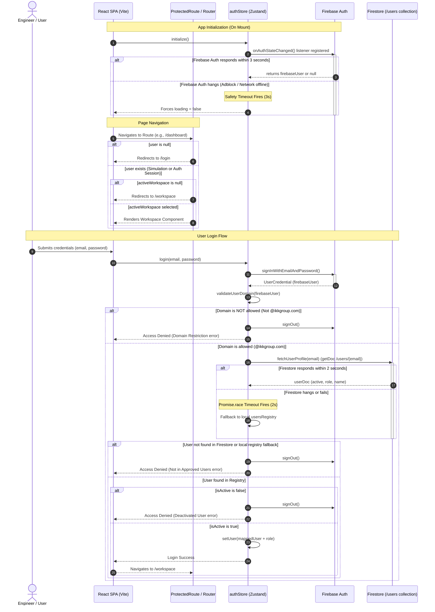

# RAXA Platform — Authentication Flow Diagram

This document details the authentication and authorization flow, routing guards, and database registry checks for the RAXA platform.

---

## Authentication & Authorization Sequence

---

## Flow Summary

1. **Authentication Guard**: Intercepts unauthenticated routes, guiding users to `/login`.
2. **Safety Timeout (3s)**: Prevents slow network requests from freezing the page on "Verifying authentication…".
3. **Domain Verification**: Verifies email domain conforms to `@ikkgroup.com`.
4. **Registry Verification**: Looks up user profile in Firestore (under document ID `{email}`).
5. **Database Timeout (2s)**: If Firestore hangs, falls back to local in-memory registry to verify mock logins.
6. **Active State Verification**: Checks if `active === true` before granting access.
7. **Workspace Routing**: Validates `activeWorkspace` is selected before allowing access to engineering calculations.
