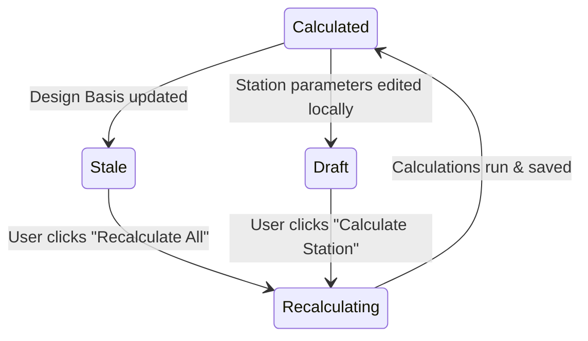

# RAXA Platform — Calculation Dependency Matrix

This document maps all engineering formulas, their input-to-output dependencies, and defines the reactive **"Needs Recalculation"** workflow to manage state consistency on the RAXA Platform.

---

## 1. Engineering Calculation Modules & Formula References

The RAXA Pipeline module calculates cathodic protection design parameters using the following mathematical formulas:

### Module 1: Pipeline Surface Area ($A_s$)
*   **Formula**:
    $$A_s = \pi \cdot D \cdot L$$
    where:
    *   $D$ = Outside diameter ($m$) = `outerDiameterInch * 0.0254`
    *   $L$ = Section/segment length ($m$) = `segment.lengthM`
*   **Dependent Calculations**: Protection Current Requirement ($I_{req}$)

### Module 2: Protection Current Requirement ($I_{req}$)
*   **Formula**:
    $$I_{req} = \sum (A_{s,i} \cdot i_{T,i}) \cdot f_{spare}$$
    where:
    *   $A_{s,i}$ = Surface area of segment $i$ ($m^2$)
    *   $i_{T,i}$ = Temperature-corrected current density of segment $i$ ($mA/m^2$)
    *   $f_{spare}$ = Spare/contingency factor (default: `1.30`) = `project.spareFactor`
*   **Temperature Correction ($i_T$)**:
    *   *Saudi Aramco (Exponential)*: $i_T = i_{base} \cdot 1.25^{\frac{T - 30}{10}}$
    *   *NACE SP0169 (Linear)*: $i_T = i_{base} \cdot [1 + (T - 30) \cdot 0.025]$
    where:
    *   $i_{base}$ = Base current density ($mA/m^2$) = `segment.currentDensityBase`
    *   $T$ = Operating temperature (°C) = `segment.opTempC`

### Module 3: Groundbed Resistance ($R_g$)
*   **Deepwell Dwight (1936)**:
    $$R_{gd} = \frac{\rho}{2\pi L} \cdot \left[ \ln\left(\frac{8L}{d}\right) - 1 + \frac{L}{4h} \right]$$
*   **Shallow Vertical Sunde (1968)**:
    $$R_{gs} = \frac{R_{single}}{N} + R_{mutual}$$
    $$R_{mutual} = \frac{\rho}{\pi L N^2} \cdot \sum_{i=1}^{N-1} \ln\left(\frac{2 \cdot i \cdot S}{L}\right)$$
*   **Distributed**:
    $$R_{g\cdot dist} = \frac{R_{single}}{N}$$
    where:
    *   $\rho$ = Soil resistivity ($\Omega\cdot m$) = `soilResistivityOhmCm / 100`
    *   $L$ = Active length of anode/column ($m$) = `activeLengthM`
    *   $d$ = Borehole/anode diameter ($m$) = `boreholeDiaM`
    *   $h$ = Depth to midpoint ($m$) = `startDepthM + L/2`
    *   $N$ = Number of anodes = `proposedAnodes`
    *   $S$ = Anode spacing center-to-center ($m$) = `anodeSpacingM`

### Module 4: Cable Circuit Resistance ($R_c$)
*   **Tail Parallel Resistance ($R_{ac}$)**:
    $$R_{ac} = \frac{1}{\sum_{i=1}^{N} \frac{1}{L_{tail,i} \cdot r_{tail}}}$$
*   **Total Cable Resistance ($R_c$)**:
    $$R_c = R_{ac} + (L_{pos} \cdot r_{pos}) + (L_{neg,main} \cdot r_{neg,main}) + (L_{neg,sec} \cdot r_{neg,sec})$$
    where:
    *   $L_{tail,i}$ = Individual anode tail cable lengths ($m$)
    *   $r_{tail}, r_{pos}, r_{neg}$ = Linear resistance of cables ($\Omega/m$) matching `CABLE_SPECS` based on cross-section Area ($mm^2$).

### Module 5: TR Circuit Analysis
*   **Total Circuit Resistance ($R_T$)**:
    $$R_T = R_g + R_c + R_{emf} + R_s$$
    $$R_{emf} = \frac{2 \cdot V_{emf}}{I_{rated}}$$
*   **Minimum Rectifier Voltage Output ($V_{min}$)**:
    $$V_{min} = (R_g + R_c + R_s) \cdot I_{rated} + V_{emf}$$
    where:
    *   $V_{emf}$ = Back Electromotive Force ($V$) = `designBasis.backEmfV`
    *   $R_s$ = Structure resistance ($\Omega$) = `designBasis.structureResistanceOhm`
    *   $I_{rated}$ = Rectifier rated current ($A$) = `station.tr.ratedCurrent`

### Module 6: Anode Bed Design Life ($Y$)
*   **Formula**:
    $$Y = \frac{N \cdot W \cdot U_f}{C \cdot I_{rated}}$$
    where:
    *   $N$ = Anode quantity = `proposedAnodes`
    *   $W$ = Anode weight ($kg$) = `anodeSpec.weightKg`
    *   $U_f$ = Anode utilization factor (default: `0.85`)
    *   $C$ = Anode consumption rate ($kg/A\cdot year$) = `anodeSpec.consumptionRate`

---

## 2. Field Dependency Matrix

The following matrix maps which central **Design Basis** and station-level input parameters affect specific calculated outputs.

| Input Parameter | Surface Area | Current Req. | Groundbed Res. | Cable Res. | TR Voltage | Design Life | Coke Req. |
| :--- | :---: | :---: | :---: | :---: | :---: | :---: | :---: |
| `outerDiameterInch` (DB) | 🔴 | 🔴 | | | | | |
| `systemDesignLifeYears` (DB) | | | | | | 🔴 | |
| `soilResistivityOhmCm` (DB) | | | 🔴 | | 🔴 | | |
| `backEmfV` (DB) | | | | | 🔴 | | |
| `structureResistanceOhm` (DB)| | | | | 🔴 | | |
| `coatingEfficiencyPct` (DB) | | 🔴 | | | | | |
| `cokeContingencyPct` (DB) | | | | | | | 🔴 |
| `segment.lengthM` (Station) | 🔴 | 🔴 | | | | | |
| `proposedAnodes` (Station) | | | 🔴 | 🔴 | 🔴 | 🔴 | 🔴 |
| `station.tr.ratedCurrent` | | | | | 🔴 | 🔴 | |

*(🔴 indicates a direct calculation dependency)*

---

## 3. "Needs Recalculation" State Workflow

To guarantee data integrity while avoiding UI lag and unnecessary database write operations, RAXA utilizes a **"Needs Recalculation"** workflow rather than automatic instantaneous background recalculation.

### Workflow State Machine



### Protocol Details

1.  **State Invalidation**:
    When a central Design Basis parameter is updated, the system does not run the calculations in the background. Instead, it marks the calculated status of all dependent stations as `needs_recalculation` and clears the `lastCalcResult` cache:
    ```javascript
    // projectStore.js action
    setNeedsRecalculation: () => set((state) => {
      const project = state.getProject();
      project.stations.forEach(st => {
        st.status = 'needs_recalculation';
      });
      project.hasCalculationsMismatch = true;
    })
    ```

2.  **UI Warning Indicators**:
    *   **Dashboard Alert**: A warning banner is displayed at the top of the project workspace:
        > ⚠️ **Design Basis Out of Sync**: 4 stations need recalculation due to recent changes to *Outer Diameter*.
    *   **Sidebar Badges**: The calculation status badge next to each station in the sidebar shifts from green `Calculated` to amber `Needs Recalculation`.
    *   **Primary Action Banner**: The "Export PDF Report" and "Submit for Review" buttons are disabled, showing a tooltip: *"All calculations must be up-to-date before exporting or submitting."*

3.  **Recalculation Execution**:
    *   An explicit **"Recalculate All Stations"** action is highlighted on the project dashboard.
    *   Clicking this action executes `runStationCalculations()` sequentially for all out-of-sync stations, writes the updated results, resets the status to `calculated`, and sets `hasCalculationsMismatch = false`.

4.  **Logical Tenant Isolation (`organizationId`)**:
    *   All queries and actions verify that the user's `organizationId` matches the project's `organizationId`.
    *   If a recalculation is triggered, the transaction checks tenant ownership to prevent unauthorized data manipulation.
