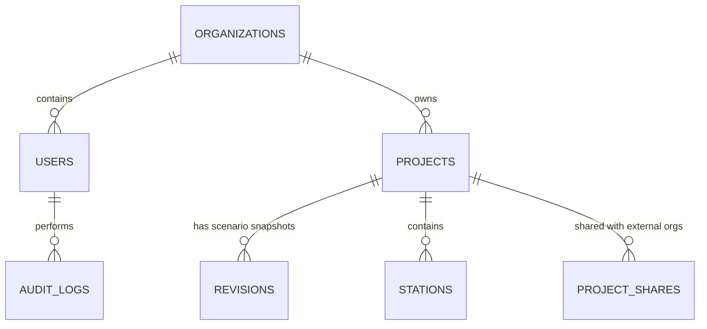
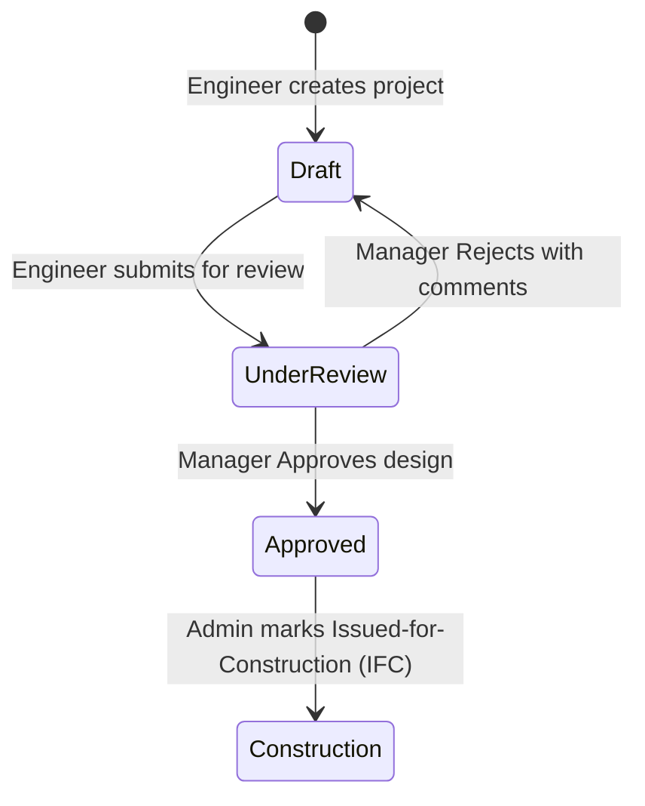

# RAXA Platform — Firestore Database Evolution Plan

This document maps the evolution of the RAXA database from a single-tenant local storage model to a multi-tenant, collaborative **Cloud Firestore** architecture.

---

## 1. Relational Entity Relationship (ER) Diagram

The diagram below maps the relationships between the root collection groups in Firestore:



---

## 2. Master Firestore Collection Schemas

We will leverage a flat root collection layout combined with nested sub-collections where atomic locking or revision snapshots are required.

### 1. `/organizations` (Root Collection)
Defines the enterprise tenants using RAXA.

```json
{
  "id": "org-ikk-construction",
  "name": "IKK Construction Group",
  "domain": "ikkgroup.com",
  "status": "active",
  "licenseType": "enterprise",
  "createdAt": "2026-06-11T16:00:00Z"
}
```

### 2. `/users` (Root Collection)
Stores authorized user accounts. Document ID is the user's `email.toLowerCase()`.

```json
{
  "uid": "fb-auth-uid-12345",
  "email": "engineer@ikkgroup.com",
  "name": "Eyad Engineer",
  "role": "engineer",
  "active": true,
  "orgId": "org-ikk-construction",
  "businessUnitId": "bu-saudi-cp",
  "createdAt": "2026-06-11T16:00:00Z"
}
```

### 3. `/projects` (Root Collection)
Maintains project metadata and the central **Design Basis**.

```json
{
  "id": "proj-4589-322",
  "projectNumber": "ECP25-0292",
  "projectName": "PERMANENT CATHODIC PROTECTION DESIGN",
  "clientName": "Saudi Aramco",
  "orgId": "org-ikk-construction",
  "businessUnitId": "bu-saudi-cp",
  "status": "draft", // draft | under_review | approved | construction
  "ownerUid": "fb-auth-uid-12345",
  "createdAt": "2026-06-11T16:10:00Z",
  "updatedAt": "2026-06-11T19:30:00Z",
  
  // Embedded Central Design Basis Model (Single Source of Truth)
  "designBasis": {
    "outerDiameterInch": 48.0,
    "wallThicknessInch": 0.875,
    "pipelineLengthM": 29200,
    "operatingTemperatureC": 57.2,
    "soilResistivityOhmCm": 361,
    "backEmfV": 2.0,
    "structureResistanceOhm": 0.055,
    "systemDesignLifeYears": 25
  }
}
```

### 4. `/projects/{projectId}/stations` (Nested Sub-Collection)
Stores design stations (e.g. ICCP deepwell stations) for a project. Large arrays of stations are broken out into individual documents to avoid hitting the 1MB Firestore document limit.

```json
{
  "id": "station-001",
  "name": "ICCP Station-1",
  "location": "KM 00+000",
  "designMode": "deepwell",
  
  // Station Specific Geometry (overrides or additions to design basis)
  "groundbed": {
    "type": "deepwell",
    "numHoles": 1,
    "boreholeDiaM": 0.25,
    "anodeSpacingM": 1.5
  },
  "proposedAnodes": 9,
  
  // Calculation results cache
  "lastCalcResult": {
    "requiredCurrentA": 0.1979,
    "groundbedResistanceOhm": 0.1135,
    "totalCircuitResistanceOhm": 0.5839
  },
  "status": "calculated"
}
```

### 5. `/projects/{projectId}/revisions` (Nested Sub-Collection)
Saves frozen snapshot revisions representing engineering milestones (e.g., REV-0 for client review).

```json
{
  "id": "rev-0",
  "revNumber": "REV-0",
  "description": "Issued for Client Review",
  "createdAt": "2026-06-11T20:00:00Z",
  "createdBy": "engineer@ikkgroup.com",
  
  // Deep snapshot copy of project metadata, designBasis and all station states
  "snapshot": {
    "projectData": { "projectName": "...", "designBasis": { "..." } },
    "stations": [
      { "id": "station-001", "name": "ICCP Station-1", "..." }
    ]
  }
}
```

### 6. `/audit_logs` (Root Collection)
Tracks calculations and configuration edits for safety audits and compliance.

```json
{
  "id": "log-789456-112",
  "timestamp": "2026-06-11T19:30:00Z",
  "userId": "fb-auth-uid-12345",
  "userEmail": "engineer@ikkgroup.com",
  "orgId": "org-ikk-construction",
  "projectId": "proj-4589-322",
  "action": "update_design_basis", // create_project | update_design_basis | run_calculation | approve_revision
  "details": {
    "parameterChanged": "outerDiameterInch",
    "oldValue": 48.0,
    "newValue": 42.0
  }
}
```

---

## 3. Workflow & Approval State Machine

Projects navigate through a rigid state lifecycle to protect reports and bills of materials from accidental post-approval modification:



*   **Draft**: Editable by Admins, Managers, and Engineers.
*   **UnderReview**: Locked. No fields can be modified. Reviewers and Managers add review comments.
*   **Approved**: Read-only for all roles. Locks the **Bill of Materials** and reports to prevent adjustments.
*   **Construction**: Permanently locked. Prompts version snapshotting if a redesign is requested.

---

## 4. Query Indexes & Scaling Rules

To ensure rapid dashboard loads, Firestore index requirements are defined as:

### Composite Indexes Required

| Collection | Fields | Order | Purpose |
|:---|:---|:---|:---|
| `/projects` | `orgId` (Ascending) + `updatedAt` (Descending) | Index | Query organization projects by last activity. |
| `/projects` | `orgId` (Ascending) + `status` (Ascending) | Index | Group projects on corporate dashboards by state. |
| `/audit_logs` | `projectId` (Ascending) + `timestamp` (Descending) | Index | Retrieve chronological edit logs for a project. |
