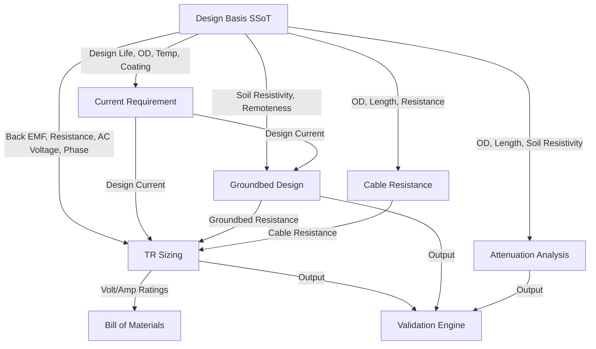

# RAXA Platform — Central Design Basis Architecture

This document establishes the architecture for the **Design Basis**—the single source of truth (SSoT) for project-wide engineering parameters on the RAXA Platform.

---

## 1. Architectural Vision & Objective

Duplicated inputs across engineering modules introduce data inconsistency and force redundant entries. The **Design Basis** isolates global project constants centrally. All downstream engineering modules (e.g. Current Requirement, Groundbed Design, Cable Resistance, TR Sizing, Attenuation) consume these parameters reactively.

When a user modifies a central parameter (e.g., changing the Pipeline Outer Diameter from 48" to 42"), the change automatically cascades through all modules, invalidating stale calculations and triggering recalculations.

---

## 2. Central Design Basis Data Model

The global Design Basis is represented as a structured object nested inside the active project state.

### Master Schema Definition (`DesignBasis`)

```typescript
interface DesignBasis {
  // 1. Project Information
  projectNumber: string;         // e.g., "ECP25-0292"
  clientName: string;            // e.g., "Saudi Aramco"
  projectName: string;           // e.g., "Pipeline Cathodic Protection"
  designerName: string;          // Name of the lead designer
  designStandard: 'saudiAramco' | 'nace' | 'iso'; // Regulatory engineering rules

  // 2. Pipeline Geometry & Operation
  pipelineName: string;          // Name/Identifier of the pipeline
  outerDiameterInch: number;     // OD in inches (e.g., 48)
  wallThicknessInch: number;     // Pipe wall thickness in inches (e.g., 0.875)
  pipelineLengthM: number;       // Pipeline length in meters (e.g., 29200)
  operatingTemperatureC: number; // Operating temperature in Celsius (e.g., 57.2)

  // 3. Coating Specification
  coatingType: string;           // e.g., "fusion_bonded_epoxy" (FBE)
  coatingEfficiencyPct: number;  // Coating efficiency factor (e.g., 98.0)

  // 4. Environmental Conditions
  soilResistivityOhmCm: number;  // Design soil resistivity in Ohm-cm (e.g., 361)
  minRemotenessDistanceM: number;// Required remoteness distance for deepwell (e.g., 20)
  actualRemotenessDistanceM: number; // Actual distance to nearest foreign structure (e.g., 56)

  // 5. Electrical Parameters
  backEmfV: number;              // Back Electromotive Force voltage in Volts (e.g., 2.0)
  structureResistanceOhm: number;// Structure-to-ground resistance in Ohms (e.g., 0.055)
  acInputVoltageV: number;       // AC power supply voltage in Volts (e.g., 480)
  acInputPhase: 1 | 3;           // 1-Phase or 3-Phase power
  trPowerFactor: number;         // Power factor of the TR unit (e.g., 0.8)
  trEfficiencyPct: number;       // Efficiency of the TR unit (e.g., 80.0)

  // 6. Design Criteria & Margin
  systemDesignLifeYears: number; // Required system life in years (e.g., 25)
  cokeContingencyPct: number;    // Contingency allowance for calc (e.g., 10.0)
}
```

---

## 3. Downstream Parameter Dependency Map

The following matrix maps how Design Basis fields propagate to dependent calculation modules:



### Detailed Field Propagation Matrix

| Design Basis Parameter | Primary Dependent Module | Calculations Affected | Lock Condition in Downstream UI |
|:---|:---|:---|:---|
| **Outer Diameter (`outerDiameterInch`)** | Current Requirement, Attenuation | Total Surface Area ($m^2$), current density corrections, attenuation propagation constants | Read-only input on Pipeline and Attenuation sub-pages. |
| **System Design Life (`systemDesignLifeYears`)** | Groundbed Design | Anode consumption mass, total anode count requirement | Disabled on Groundbed page; displays "Locked to Design Basis". |
| **Soil Resistivity (`soilResistivityOhmCm`)** | Groundbed Design, Attenuation | Groundbed-to-earth resistance ($R_g$), linear groundbed attenuation attenuation | Disabled on Groundbed & Attenuation pages. |
| **Back EMF (`backEmfV`)** | TR Sizing | Minimum TR output voltage ($V_{tr} = I \cdot R + V_{emf}$) | Read-only on TR Sizing page. |
| **Structure Resistance (`structureResistanceOhm`)** | TR Sizing, Cable Resistance | Cable circuit loop calculations, loop voltage drop | Read-only on Cable and TR Sizing pages. |
| **Coating Efficiency (`coatingEfficiencyPct`)** | Current Requirement | Breakdown current requirement, current density checks | Read-only on Current Requirement page. |

---

## 4. State Management & Auto-Refresh Strategy

We leverage a centralized **Zustand store** with Immer middleware to govern the Design Basis state updates.

### 1. Store State Structuring
Inside the Zustand store, the project object hosts the `designBasis` properties. We declare a single project updating action:

```javascript
// store/projectStore.js
updateDesignBasis: (fields) =>
  set((state) => {
    const project = state.projects.find((p) => p.id === state.activeProjectId)
    if (!project) return
    
    // 1. Update Design Basis SSoT
    Object.assign(project.designBasis, fields)
    project.updatedAt = new Date().toISOString()
    
    // 2. Invalidate all dependent module calculated caches
    project.stations.forEach((station) => {
      station.lastCalcResult = null
      station.status = 'draft' // Reset calculated status back to draft
      station.validationErrors = null
    })
  })
```

### 2. Auto-Refresh & Calculation Cascade Flow

To prevent stale data, a reactive trigger is implemented whenever a Design Basis parameter is updated:

```text
User updates OD in Design Basis 
  │
  ▼
Zustand Action: updateDesignBasis()
  │
  ├─► Sets activeProject.designBasis.outerDiameterInch = 42
  ├─► Sets all project.stations[i].lastCalcResult = null (Invalidates cache)
  └─► Sets project.stations[i].status = "draft"
  │
  ▼
React Component Subscription Trigger
  │
  ├─► Sidebar Navigation badges update to show calculated statuses reset to draft
  ├─► Validation module triggers warning: "Parameters changed. Recalculation required."
  └─► Topbar "Calculate All" button highlights active.
```

### 3. Subscription Optimization (Selectors)
React views subscribe to specific Design Basis slices rather than the entire store. This avoids unnecessary re-renders when unrelated properties change:

```javascript
// Component subscription example
const outerDiameter = useProjectStore(
  (state) => state.getProject().designBasis.outerDiameterInch
)
```

---

## 5. Backward Compatibility & Verification

1.  **Legacy Project Migration**:
    Upon loading a legacy project file (from pre-Design Basis versions), a store migration helper maps legacy parameters (e.g. `project.design_life_target` or `station.groundbed.soilResistivityOhmCm`) into the new `designBasis` object.
2.  **Validation Rule Enforcement**:
    The [rulesEngine.js](file:///home/rworld_pop/projects/PL%20PCP/cp-platform/src/engine/rules/rulesEngine.js) is updated to check constraints directly against `project.designBasis` instead of duplicate local station fields.
