# ENGINEERING DATAFLOW MAP

> **Companion document to `MODULE_DEPENDENCY_MATRIX.md`.**
> This file shows **how data moves** through the system — store writes, derived state, cache lifetimes, and persistence boundaries.
> **No file modifications.** All claims are sourced from the static read of the codebase.

---

## 1. Persistence boundaries

The platform has **four** persistence tiers, each with a different refresh contract:

| Tier | Storage | Refresh | Source of truth? |
|---|---|---|---|
| **Live state** | Zustand in-memory + `localStorage` via `persist` middleware | Synchronous, every store action | **Yes** for project/station/attenuation data |
| **Calculated cache** | `project.stations[].lastCalcResult` (in the persisted store) | Refreshed only on `calculateStation` | Derived — must be invalidated on input change |
| **Offline cache** | IndexedDB via `offline/calculationCache.js` | Refreshed after each `calculateStation` (`cacheCalculation`) | Mirror of `lastCalcResult` |
| **Activity log** | Firestore `activity` collection | Live subscription via `onSnapshot` | Yes (append-only) |

### 1.1 Store layout (Zustand slices)

```text
projectStore
├── projectSlice       — projects[], activeProjectId, activeWorkspace
├── stationSlice       — activeStationId, addStation/removeStation/updateStation/updateSegment/addSegment/removeSegment
├── designSlice        — updateDesignBasis, setNeedsRecalculation, updateTankParameters, updateVesselParameters
├── calculationSlice   — calculateStation, calculateAllStations, runTankCalculations, runVesselCalculations
├── workflowSlice      — advanceWorkflow, createRevision, restoreRevision, compareRevisions
├── attenuationSlice   — attenuationInput, attenuationResult, attenuationDirty, attenuationCalculating
├── uiSlice            — ui: { sidebarCollapsed, calculatingStationId, theme }
├── scenarioSlice      — saveScenario/runScenario/etc
└── assetSlice (digitalTwin)
                       — digitalTwin: { registry, healthScores, riskAssessments, lastRefreshedAt }
```

Slices are composed in `store/projectStore.js:113-127`. State is persisted to `localStorage['cp-platform-project']` (key in `repositories/projectRepository.js`).

### 1.2 The `partialize` whitelist

Only these fields are persisted:

```js
projects, activeProjectId, activeStationId, attenuationInput,
attenuationResult, activeWorkspace
```

Notable: `digitalTwin`, `ui`, `scenarios` (per project) are **not** persisted. A page refresh loses the digital twin and re-creates it on the next `refreshDigitalTwinForProject` call.

---

## 2. Live data flow per user action

The following sequence diagrams describe the live flow for each major user action. Each is the result of static reading of the corresponding slice/page; no instrumentation.

### 2.1 User edits a pipeline segment

```text
PagePipeline
  └─ onChange → updateSegment(stationId, segId, fields)
        └─ stationSlice.updateSegment
              ├─ station.pipelineSegments[i] = { ...seg, ...fields }
              ├─ station.lastCalcResult = null          ← stale invalidated
              ├─ project.updatedAt = now
              └─ state.attenuationDirty = true          ← attenuation stale (M7)
                    (and not state.attenuationResult = null — result kept but flagged dirty)

Subscribers re-render with stale=lastCalcResult=null:
  ├─ PageCurrentRequirement:  sees status: 'input_complete' or 'draft', no banner
  ├─ PageGroundbed:           sees no banner (no staleness UI in this page)
  ├─ PageCableResistance:     sees no banner; "Results" panel shows old numbers
  ├─ PageTRSizing:            sees staleness-banner (isStale computed from status)
  ├─ PageValidation:          sees no banner
  ├─ PageCompliance:          sees no banner; rules may show "N/A"
  ├─ AttenuationPage:         sees STALE state via resolveAttenuationState()
  ├─ PageBOM:                 shows nothing (BOM gate)
  └─ digitalTwin:             next refresh will skip station because lastCalcResult is null
```

**Failure mode:** Pages without explicit staleness banners (`PageGroundbed`, `PageCableResistance`, `PageValidation`, `PageCompliance`) will silently show pre-edit numbers until the user manually clicks `Calculate` somewhere.

### 2.2 User changes soil resistivity in `PageSoilResistivity`

```text
PageSoilResistivity
  └─ onApplyAverage → updateProject(p => { p.designBasis.soilResistivityOhmCm = ... })
        └─ projectSlice.updateProject
              ├─ project.designBasis.soilResistivityOhmCm = newValue
              └─ project.updatedAt = now

Cascading consequences (manual):
  ✗ station.lastCalcResult NOT cleared
  ✗ state.attenuationDirty NOT set
  ✗ state.attenuationResult NOT cleared

Subscribers:
  ├─ PagePipeline:           shows new ρ (read-only)
  ├─ PageCurrentRequirement: shows old I_req (stale)
  ├─ PageGroundbed:          shows old R_G (stale) — no banner
  ├─ PageTRSizing:           shows old V_min (stale)
  ├─ AttenuationPage:        shows old α (stale) — but attenuationDirty flips to true via stationSlice updates on other pages, not via this
  └─ digitalTwin:            next refresh will see new ρ in designBasis but old engine values
```

**Failure mode (high):** Soil resistivity change is the **single most invasive** edit in the project. The current store does not propagate an invalidation event. The user is expected to know to visit every page and click `Calculate`. This is the worst staleness surface in the project.

### 2.3 User changes Design Basis (`PageProjectSetup`)

```text
PageProjectSetup
  └─ onChange → updateDesignBasis({ acInputVoltageV: ... })
        └─ designSlice.updateDesignBasis
              ├─ project.designBasis = { ...designBasis, ...fields }
              ├─ for each station: station.status = 'needs_recalculation'
              ├─ project.tank.status = 'needs_recalculation'
              ├─ project.vessel.status = 'needs_recalculation'
              ├─ project.hasCalculationsMismatch = true
              └─ project.updatedAt = now

Subscribers:
  ├─ PageTRSizing:           staleness-banner appears (status === 'needs_recalculation')
  ├─ PageCurrentRequirement: staleness-banner appears
  ├─ PageGroundbed:          no banner
  ├─ PageCableResistance:    no banner
  ├─ PageValidation:         no banner
  ├─ PageCompliance:         rules may show "N/A" but no banner
  ├─ PageBOM:                nothing (BOM gate)
  ├─ PageReport:             `!hasCalculationsMismatch` check disables export
  └─ digitalTwin:            not invalidated; next refresh will run with new designBasis
```

**Partial mitigation:** `setNeedsRecalculation` is the only sync event that touches **all** stations. The other slices (SoilResistivity, Cable, TR, etc.) do not.

### 2.4 User runs `Calculate All` from Dashboard

```text
PageDashboard
  └─ handleCalculateAll → calculateAllStations()
        └─ calculationSlice.calculateAllStations
              ├─ for each station: calculateStation(s.id)
              │     └─ runFullCalculation(station, project)
              │           ├─ validateStation(station)
              │           ├─ captureInputAudit(station, project)
              │           ├─ getActiveStandard(project)
              │           ├─ runStationCalculations(station, life, standard, project)
              │           ├─ runRules(station, result, standard)
              │           ├─ generateAlternatives(station, result, life, standard)
              │           ├─ generateBOM(station, result, standard)  (unless project.status === 'draft')
              │           └─ buildTraceRecord(station, project, result, inputAudit)
              │     └─ cacheCalculation(stationId, result)  → IndexedDB
              │
              ├─ runTankCalculations()
              ├─ runVesselCalculations()
              └─ project.hasCalculationsMismatch = false

Subscribers:
  ├─ All pages: re-read station.lastCalcResult
  ├─ AttenuationPage: derived input changes → STALE → user re-runs attenuation calc
  ├─ digitalTwin: re-renders with new health/risk on next commission
  └─ PageReport: enables export
```

---

## 3. Read pathways — every consumer → every producer

For each *consumer* module below, the row traces back to the *producer* modules whose outputs it depends on, and whether the consumer waits for fresh data or tolerates stale data.

| Consumer | Reads from | Stale tolerated? | Invalidation source |
|---|---|---|---|
| `PagePipeline` | `designBasis` (ρ, remoteness) | yes (read-only display) | none |
| `PageSoilResistivity` | self | — | — |
| `PageCurrentRequirement` | `pipelineSegments`, `designBasis.systemDesignLifeYears`, `getActiveStandard` | warns but shows stale | `station.status === 'needs_recalculation'` |
| `PageGroundbed` | `lastCalcResult` (display), `designBasis` | yes, no banner | none (gap) |
| `PageCableResistance` | `lastCalcResult` (R_G, R_c), `designBasis` | yes, no banner | none (gap) |
| `PageTRSizing` | `lastCalcResult`, `designBasis` | warns | `station.status === 'needs_recalculation'` |
| `AttenuationPage` | derived from project (not `lastCalcResult`); `attenuationInput` (cached) | formal STALE state | `state.attenuationDirty` (set by stationSlice in M7) |
| `PageValidation` | `lastCalcResult.checks` | yes, no banner | none (gap) |
| `PageOptimizer` | `station.alternatives[]` | yes (cached) | none (gap — re-run alternatives on `calculateStation`) |
| `PageSensitivity` | clones station; uses designBasis | yes, but local recompute | local only |
| `PageCompliance` | `lastCalcResult`, `complianceNotes/Status` (manual) | warns | `!currentStation.lastCalcResult` |
| `PageBOM` | `lastCalcResult`, `BOM_ALLOWED_STATUSES` | gates display | status |
| `PageReport` | all `lastCalcResult`, `project.tank, project.vessel` | gates export | `allCalculated` + `!hasCalculationsMismatch` |
| `PageDashboard` | derived; `digitalTwin.{healthScores, riskAssessments}` | recomputes per render | every render |
| `digitalTwin.healthScoreEngine` | `lastCalcResult`, `designBasis.systemDesignLifeYears` | tolerates nulls (returns 0) | null-safe |
| `digitalTwin.riskEngine` | `lastCalcResult`, `designBasis.systemDesignLifeYears` | tolerates nulls | null-safe |
| `engine.sensitivity` | clones station + project; recomputes via `runStationCalculations` | always fresh (clones) | self-invalidated |
| `engine.optimizer` | `lastCalcResult` from `runFullCalculation` | fresh | self-invalidated |
| `engine.scenarios.runScenario` | `lastCalcResult` from re-run | fresh | self-invalidated |
| `engine.trace.calculationTraceEngine` | `lastCalcResult`, designBasis, `inputAudit` | fresh at trace time | self-invalidated |
| `engine.dashboard.workflowEngine` | station.status, designBasis fields | fresh per render | self-invalidated |
| `engine.dashboard.projectHealthEngine` | `lastCalcResult`, station.status | fresh per render | self-invalidated |
| `engine.standardsValidationEngine` | `lastCalcResult`, `station.*`, designBasis, `getActiveStandard` | fresh at validation time | self-invalidated |
| `engine.rules.rulesEngine` | `station`, `result`, `standardConfig` | fresh at rule time | self-invalidated |
| `engine.rules.bomEngine` | `station.*`, `result.*`, `standardConfig` | fresh at BOM time | self-invalidated |
| `reporting.excelEngine` | `lastCalcResult`, `station.*` | reads whatever is current | none (assumes user ran Calculate All) |
| `reporting.pdfGenerator` | `lastCalcResult`, `station.*` | reads whatever is current | none |
| `reporting.bomExporter` | `BOMItem[]` (already produced) | — | — |

---

## 4. Cached values and their lifetimes

| Cache | Owner | Lifetime | Refresh trigger |
|---|---|---|---|
| `attenuationInput` | attenuationSlice | until next `replaceAttenuationInput` | M7: pushed by AttenuationPage on project change |
| `attenuationResult` | attenuationSlice | until next `runAttenuationCalculation` | user action |
| `station.lastCalcResult` | station object | until next `calculateStation` or `station.status = 'needs_recalculation'` | user action, or `updateDesignBasis`/`updateStation` |
| `station.insights` | station object | until next `calculateStation` | user action |
| `station.alternatives` | station object | until next `calculateStation` | user action |
| `station.validationErrors` | station object | until next `calculateStation` | user action |
| `station.bom` (via `lastCalcResult.bom`) | lastCalcResult | until next `calculateStation` | user action |
| `station.trace` (via `lastCalcResult.trace`) | lastCalcResult | until next `calculateStation` | user action |
| `project.tank.lastCalcResult` | project.tank | until next `runTankCalculations` | user action |
| `project.vessel.lastCalcResult` | project.vessel | until next `runVesselCalculations` | user action |
| `project.complianceNotes/Status` | project | until next `updateProject` | user action |
| `project.scenarios` | project | until next scenario action | user action |
| `project.revisions[]` | project | until next `createRevision` | user action |
| `digitalTwin.registry` | store | until next `refreshDigitalTwinForProject` | user action (rare) |
| `digitalTwin.healthScores[stationId]` | store | until next `commissionStationAssets` | user action |
| `digitalTwin.riskAssessments[stationId]` | store | until next `commissionStationAssets` | user action |
| `localStorage['cp-platform-project']` | Zustand persist | every store action | every write |
| `IndexedDB calculation cache` | offline | until next `calculateStation` (post-write) | every `calculateStation` |

**Observation:** The only field with a **formal state machine** for staleness is `attenuationInput` / `attenuationResult` (M7 hardening). All other caches rely on the user's intuition that "Calculate" must be re-run.

---

## 5. Cross-engine data flow

```text
station (from store)
    │
    ▼
[validateStation] ─── Zod schemas ───► validationErrors[]
    │
    ▼
[captureInputAudit] ─── project.designBasis.designStandard ───► frozen snapshot
    │
    ▼
[getActiveStandard] ─── project.activeStandard / factory ───► standardConfig
    │
    ▼
[runStationCalculations]
    │
    ├──► calcSurfaceArea(D, L)
    ├──► calcTempCorrectedCurrentDensity(cd, T, method, base)
    ├──► calcCurrentRequirement(segments, currentConfig)
    ├──► calcGroundbedResistance(groundbed, ρ, N)  → calc{Deepwell,ShallowVertical,Distributed}
    ├──► calcAnodeTailParallelResistance(tailLengths, cableSize)
    ├──► calcCableResistances(cables, N)
    ├──► calcTRCircuit(R_G, R_c, V_emf, R_s, V_tr, I_tr, config)
    ├──► calcDesignLife(N, W, C, I_tr, util)
    └──► calcCokeRequirement(activeLen, cokeConfig)
    │
    ▼
[CalcResult]  { surfaceArea, cd, I_req, R_G, R_c, V_min, life, ... }
    │
    ├──► [runRules]   → checks[], insights[], allPassed
    ├──► [generateAlternatives] → alternatives[]
    ├──► [generateBOM]           → bom[]   (if project.status !== 'draft')
    ├──► [buildTraceRecord]      → trace.steps[]
    │
    ▼
runFullCalculation output
    │
    ▼
[station.lastCalcResult, station.insights, station.alternatives, station.status, station.validationErrors]
    │
    ├──► page consumers re-render
    ├──► digitalTwin re-commissions on next refresh
    ├──► excelEngine/pdfGenerator read on export
    └──► IndexedDB mirror via cacheCalculation
```

---

## 6. Attenuation-specific data flow (post-M7)

```text
project (from store)
    │
    ▼
buildAttenuationInputFromProject(project, activeStationId)
    │
    ├─── pipe: from first station's first pipelineSegment
    │         (od, wallThk, lengthM, opTempC, currentDensityBase)
    │         totalLengthKm = Σ segment.lengthM / 1000
    │         maxProtectionLengthKm = span between min/max station position
    │         steelResistivityMicroOhmCm = designBasis OR engine default
    │
    ├─── coating: from designBasis OR engine default
    │
    ├─── potentials:
    │         naturalMv = designBasis.naturalPotentialMv OR 550
    │         drainPointMv = station.tr.ratedVoltage × 1000  (or designBasis.drainPointMv)
    │         minimumMv = designBasis.minimumProtectionMv OR 850
    │
    ├─── stations: from project.stations (id, positionKm=parse(location), label=name)
    │
    └─── profileConfig: { startKm = min - 5, endKm = max + 5, stepKm = 1.0 }
    │
    ▼
{ input, validation: { isReady, reasons, guidance } }
    │
    ├── if validation.isReady === false:
    │       AttenuationPage renders EmptyStateCard with guidance + "Go to TR Sizing" etc.
    │       attenuationInput stays at last value (or null)
    │
    └── if validation.isReady === true:
            AttenuationPage useEffect → replaceAttenuationInput(input)
            attenuationSlice → attenuationDirty = true
            │
            ▼
            runAttenuationCalculation()
            │
            ├── preflightValidation (services/attenuationService.js)
            ├── runAttenuationAnalysis (engine/modules/attenuationEngine.js)
            │     ├── calculatePipeSteelArea
            │     ├── calculatePipeResistance
            │     ├── calculateLeakageResistance
            │     ├── calculateAttenuationConstant → α
            │     ├── calculateCheckPointAssessment
            │     └── calculatePotentialProfile → profile[]
            │
            ▼
            attenuationResult: { success, intermediates, checkPointAssessment, profile, summary }
            │
            ├── AttenuationExplorer renders profile with scenarios
            ├── CriticalKPDetector finds min/max
            ├── StationSpacingRecommendation finds gaps
            └── SensitivitySliders perturbs input and re-runs

On ANY upstream change:
  - stationSlice → state.attenuationDirty = true
  - AttenuationPage → resolveAttenuationState → STALE
  - UI shows "Attenuation requires recalculation" banner
```

---

## 7. Digital Twin data flow

```text
project (from store)
    │
    ▼
assetSlice.refreshDigitalTwinForProject(projectId)
    │
    ├── for each station with lastCalcResult !== null:
    │     commissionStationAssets(stationId)
    │         │
    │         ├── assetFactory.makeStationAssets(station, project)
    │         │     → [PipelineAsset?, TRUnitAsset?, GroundbedAsset?]
    │         │     (skips asset if its gating data is missing)
    │         │
    │         ├── registryReplaceStationAssets(registry, stationId, assets)
    │         │
    │         ├── healthScoreEngine.compute(station, project)
    │         │     → { score, status, factors, weights }
    │         │
    │         └── riskEngine.compute(station, project)
    │               → { consequence, likelihood, riskScore, riskLevel }
    │
    ▼
state.digitalTwin = { registry, healthScores, riskAssessments, lastRefreshedAt }

Consumers:
  - PageDashboard reads healthScores and riskAssessments for KPIs
  - digitalTwin is NOT in persist partialize → re-built on each page refresh
  - digitalTwin is NOT auto-refreshed when station inputs change
```

**Failure mode:** The digital twin drifts from reality as soon as a station is edited after the last commission. Pages reading from `digitalTwin` show stale health scores.

---

## 8. Reporting data flow

```text
PageReport
    │
    ▼
downloadEngineeringReport / exportProject
    │
    ├── excelEngine.exportProject(project)
    │     │
    │     ├── Per-station sheet from lastCalcResult + station.cables + station.tr
    │     ├── Summary sheet aggregating stations
    │     └── If !lastCalcResult → 'Station not calculated yet.' row
    │
    ├── pdfGenerator.downloadEngineeringReport(project)
    │     │
    │     ├── Cover page (project metadata, designBasis, designer fallback 'CP Engineer')
    │     ├── Per-station page (pipeline / groundbed / TR / cable / circuit / BOM / validation)
    │     └── Page X of Y (pre-computed: 2 + stations.length * 2 — incorrect when BOM empty)
    │
    └── bomExporter.exportBOMToCSV(stationName, bom)
          │
          └── CSV download with hardcoded headers
```

**Gating logic in PageReport:**
- `!hasCalculationsMismatch` (set by `designSlice.updateDesignBasis`)
- `allCalculated` (every station has `lastCalcResult`)
- `every(s => BOM_ALLOWED_STATUSES.includes(s.status))`

---

## 9. Failure flow — when a calculation throws

```text
calculateStation(stationId)
    │
    ├─ runFullCalculation(station, project)
    │     │
    │     ├─ success = false
    │     │     ├─ st.validationErrors = calcResult.validationErrors
    │     │     ├─ st.lastCalcResult = null
    │     │     ├─ st.status = (current === 'draft' ? 'draft' : 'input_complete')
    │     │     └─ project.hasCalculationsMismatch = true
    │     │
    │     └─ engine exception (e.g. NaN, divide-by-zero)
    │           └─ NOT caught here → uncaught → console error
    │           └─ Station left with old lastCalcResult (inconsistent)
```

**Failure mode:** Engine exceptions are not caught in `runFullCalculation`. The only catch is in the *store action* `calculateStation` itself (try/finally for spinner only). A throw inside `runStationCalculations` will surface as an unhandled exception in the React tree.

This is mitigated for attenuation only (`services/attenuationService.js::computeAttenuation` wraps in try/catch).

---

## 10. Activity log data flow

```text
logActivityHelper(proj, action, module, details)
    │  (in projectSlice.js)
    ▼
proj.activityLog.push({ id, timestamp, user, action, module, details })
    │  (synchronous; persisted with the rest of the project)
    ▼
logActivityLogger.logActivity({ projectId, user, action, module, details })
    │  (parallel; Firestore)
    ▼
Firestore `activity` collection
    │
    ▼
subscribeToActivity(projectId, callback)
    │  (used by PageDashboard via realActivity state)
    ▼
Dashboard shows realActivity + activityToShow (derived)
```

**Observation:** Two parallel activity logs exist — `proj.activityLog` (local) and Firestore `activity` (remote). They are not reconciled. A page refresh will lose the local log entries older than the last persist.

---

## 11. Mermaid — at-a-glance architecture

```mermaid
flowchart TB
  subgraph PERSIST[Persistence]
    LS[localStorage<br/>cp-platform-project]
    IDB[IndexedDB<br/>calculationCache]
    FS[(Firestore<br/>activity)]
  end

  subgraph STORE[Zustand Store]
    PS[projectSlice]
    SS[stationSlice]
    DS[designSlice]
    CS[calculationSlice]
    WS[workflowSlice]
    AS[attenuationSlice]
    US[uiSlice]
    SC[scenarioSlice]
    AT[digitalTwin.assetSlice]
  end

  subgraph ENG[Engine pure functions]
    CALC[calculations.js]
    RES[resistivityEngine.js]
    VAL[validation.js]
    RUL[rulesEngine.js]
    BOM[bomEngine.js]
    ATT[attenuationEngine.js]
    SVL[standardsValidationEngine.js]
    OPT[optimizer.js]
    SEN[sensitivity]
    SCN[scenarios]
    TRC[trace]
    WFE[workflowEngine]
    PHE[projectHealthEngine]
    DSE[dashboardStatusEngine]
    ADE[advisor engines]
  end

  subgraph PAGES[Pages]
    P1[ProjectSetup]
    P2[Pipeline]
    P3[SoilResistivity]
    P4[CurrentRequirement]
    P5[Groundbed]
    P6[CableResistance]
    P7[TRSizing]
    P8[AttenuationPage]
    P9[Validation]
    P10[Optimizer]
    P11[Sensitivity]
    P12[Compliance]
    P13[BOM]
    P14[Report]
    P15[Dashboard]
  end

  P1 --> DS
  P2 --> SS
  P3 --> PS
  P4 --> SS
  P5 --> SS
  P6 --> SS
  P7 --> SS
  P8 --> AS
  P9 --> CS
  P10 --> CS
  P11 --> SS
  P12 --> PS
  P13 --> SS
  P14 --> CS
  P15 --> CS

  CS --> CALC
  CS --> RUL
  CS --> BOM
  CS --> OPT
  CS --> TRC
  AS --> ATT
  AT --> CALC

  CALC --> LS
  CS --> IDB
  CS --> FS

  WFE --> P15
  PHE --> P15
  DSE --> P15
  ADE --> P15
```


