# Standard Resolution Dependency Graph

Below is the dependency graph mapping how `getActiveStandard()` flows through the codebase to downstream consumers, report generators, export engines, and validation/calculation engines.

```mermaid
graph TD
    %% Source function
    GAS[getActiveStandard]
    
    %% Downstream Consumers
    GAS --> UI_Badge[StandardBadge <br> src/components/ui.jsx]
    GAS --> UI_PC[ProjectCard <br> src/pages/PageDashboard.jsx]
    GAS --> UI_InfoBox[DesignStandardInfoBox <br> src/pages/PageCurrentRequirement.jsx]
    GAS --> UI_ReqPage[PageCurrentRequirement <br> src/pages/PageCurrentRequirement.jsx]
    GAS --> UI_BOMPage[PageBOM / generateBOMForDisplay <br> src/pages/PageBOM.jsx]
    GAS --> BOM_Svc[generateStationBOM <br> src/services/bomService.js]
    GAS --> Calc_Svc[runFullCalculation <br> src/services/calculationService.js]
    GAS --> PDF_Gen[generateEngineeringReport <br> src/reporting/pdfGenerator.js]
    GAS --> Excel_Eng[exportToExcel <br> src/reporting/excelEngine.js]

    %% Validation & Calculation Engines
    Calc_Svc --> Calc_Eng[runStationCalculations <br> src/engine/modules/calculations.js]
    Calc_Svc --> Rules_Eng[runRules <br> src/engine/rules/rulesEngine.js]
    Calc_Svc --> Opt_Eng[generateAlternatives <br> src/engine/optimizer/optimizer.js]
    BOM_Svc --> BOM_Rules[bomEngine <br> src/engine/rules/bomEngine.js]

    %% Reports
    PDF_Gen --> PDF_Rep[Engineering Report <br> PDF Layout]
    Excel_Eng --> Excel_Rep[Excel Spreadsheet <br> Layout]

    %% Exports & Actions
    PDF_Rep --> PDF_Exp[PDF Export <br> PageReport.jsx:handlePDF]
    Excel_Rep --> Excel_Exp[Excel Export <br> PageReport.jsx:handleExcel]
    UI_BOMPage --> BOM_Exp[BOM View / Export]
    
    %% Styling
    classDef source fill:#f9f,stroke:#333,stroke-width:4px;
    classDef consumer fill:#bbf,stroke:#333,stroke-width:2px;
    classDef engine fill:#dfd,stroke:#333,stroke-width:2px;
    classDef report fill:#fdd,stroke:#333,stroke-width:2px;
    classDef export fill:#ffd,stroke:#333,stroke-width:2px;

    class GAS source;
    class UI_Badge,UI_PC,UI_InfoBox,UI_ReqPage,UI_BOMPage,BOM_Svc,Calc_Svc,PDF_Gen,Excel_Eng consumer;
    class Calc_Eng,Rules_Eng,Opt_Eng,BOM_Rules engine;
    class PDF_Rep,Excel_Rep report;
    class PDF_Exp,Excel_Exp,BOM_Exp export;
```

