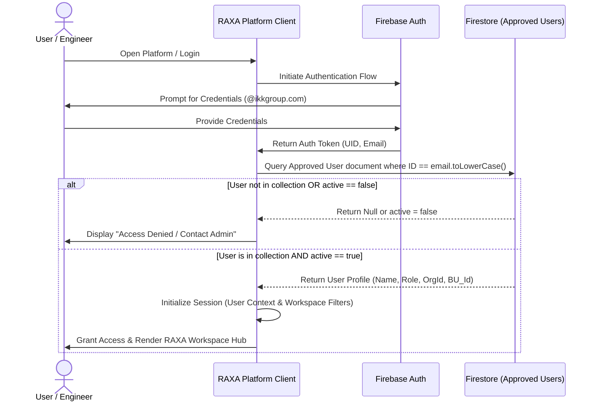
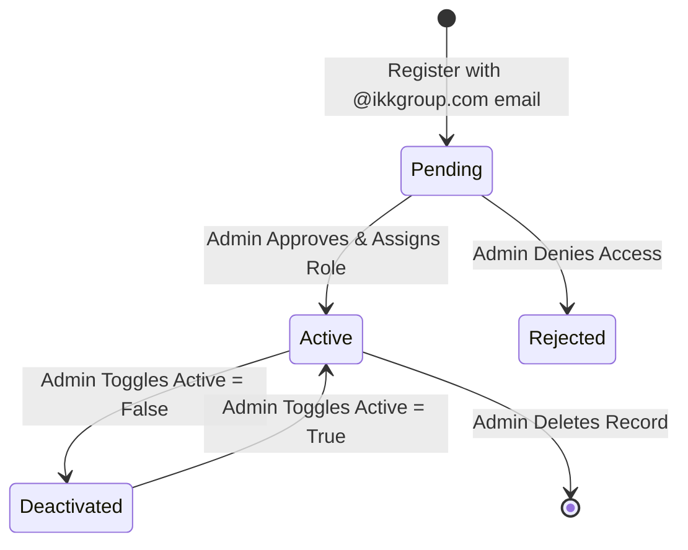

# RAXA Platform — User Access & Authorization Architecture

This document defines the security model, role-based authorization architecture, and future-ready scaling guidelines for the **RAXA Platform** (Infrastructure Protection Engineering Platform). 

---

## 1. Security Architecture Overview

RAXA secures cathodic protection and corrosion engineering calculations through a dual-layer access verification system:
1.  **Identity Layer (Firebase Auth)**: Authenticates the user's identity (e.g. Email/Password, SSO). Domain validation restricts access strictly to emails matching `@ikkgroup.com`.
2.  **Authorization Layer (Firestore Registry)**: Validates that the authenticated user exists in the approved users list, verifies that the user account is active (`active === true`), and resolves their workspace permission roles.



---

## 2. Role-Based Access Control (RBAC) Matrix

Users are assigned exactly one role representing their permission boundaries across workspaces:

| Feature / Operation | Admin | Manager | Engineer | Reviewer |
| :--- | :---: | :---: | :---: | :---: |
| **Access RAXA Workspace Hub** | ✅ | ✅ | ✅ | ✅ |
| **View Dashboards & Formulas** | ✅ | ✅ | ✅ | ✅ |
| **Inspect Calculations Traceability** | ✅ | ✅ | ✅ | ✅ |
| **Edit Pipeline/Station Configurations** | ✅ | ✅ | ✅ | ❌ |
| **Save Scenario Revisions** | ✅ | ✅ | ❌ | ❌ |
| **Delete Stations or Pipelines** | ✅ | ✅ | ❌ | ❌ |
| **Manage Approved User Registry (CRUD)**| ✅ | ❌ | ❌ | ❌ |
| **View Audit Logs & Activity** | ✅ | ❌ | ❌ | ❌ |

---

## 3. User Lifecycle Management (Admin Controls)

Administrators manage user records through the User Management console in the RAXA Pipeline module (which propagates to all other modules).

### Lifecycle State Machine



### Admin Operations
1.  **Approve User**: Admin verifies the pending registration request and saves the record with `active: true` and an assigned engineering role.
2.  **Disable User**: Sets `active: false`. The user is immediately blocked from accessing any modules upon their next API request (enforced via Firestore Security Rules).
3.  **Change Role**: Admin updates the `role` property in the user registry. This instantly modifies the user's workspace constraints.
4.  **View User Activity**: Querying the `/audit_logs` collection to view operations performed by specific user IDs.

---

## 4. Multi-Tenant Future-Ready Scaling Model

To scale RAXA from a single-tenant application to an enterprise-wide infrastructure platform, user profiles are designed with multi-organization support from day one.

### Firestore User Profile Document Schema (`/users/{email}`)

```json
{
  "uid": "fb-auth-uid-12345",
  "email": "engineer@ikkgroup.com",
  "name": "Eyad Engineer",
  "role": "engineer",
  "active": true,
  "orgId": "org-ikk-pipeline",
  "businessUnitId": "bu-saudi-cp",
  "permissions": [
    "pipeline.read",
    "pipeline.write",
    "tank.read"
  ],
  "created_at": "2026-06-11T16:00:00Z",
  "modified_at": "2026-06-11T19:00:00Z",
  "modified_by": "admin@ikkgroup.com"
}
```

### Multi-Tenant Concepts:
1.  **Organizations (`orgId`)**: Enables logical partitioning of data. Subcontractors or distinct clients access only projects matching their `orgId`.
2.  **Business Units (`businessUnitId`)**: Divides data access internally (e.g. division-level or geographical-region segmentation like "Saudi Cathodic Protection" vs. "Qatar Corrosion Control").
3.  **Cross-Project Sharing**: Multi-organization mappings are configured via a junction collection `/project_shares` (defining which organizations or users have read/write access to specific project IDs outside their home scope).

---

## 5. Secure Firestore Security Rules

The database layer enforces logical tenant containment and role-based guards:

```javascript
rules_version = '2';
service cloud.firestore {
  match /databases/{database}/documents {
    
    // Helper: Verify user exists in registry and is active
    function isApprovedUser() {
      return request.auth != null && 
        exists(/databases/$(database)/documents/users/$(request.auth.token.email)) &&
        get(/databases/$(database)/documents/users/$(request.auth.token.email)).data.active == true;
    }
    
    // Helper: Retrieve active user record
    function getUserRecord() {
      return get(/databases/$(database)/documents/users/$(request.auth.token.email)).data;
    }

    // User Registry Collection Rules
    match /users/{userEmail} {
      allow read: if request.auth != null;
      allow write: if request.auth != null && getUserRecord().role == 'admin';
    }

    // Projects Collection Rules
    match /projects/{projectId} {
      // 1. Read: Must be approved, and project orgId must match user's orgId
      allow read: if isApprovedUser() && 
        (resource.data.orgId == getUserRecord().orgId || 
         exists(/databases/$(database)/documents/project_shares/$(projectId + '_' + getUserRecord().orgId)));
         
      // 2. Write: Must be approved, match orgId, and have write permissions (role != reviewer/viewer)
      allow create: if isApprovedUser() && request.resource.data.orgId == getUserRecord().orgId;
      allow update: if isApprovedUser() && 
        resource.data.orgId == getUserRecord().orgId && 
        getUserRecord().role in ['admin', 'manager', 'engineer'];
        
      allow delete: if isApprovedUser() && 
        resource.data.orgId == getUserRecord().orgId && 
        getUserRecord().role in ['admin', 'manager'];
    }
  }
}
```
