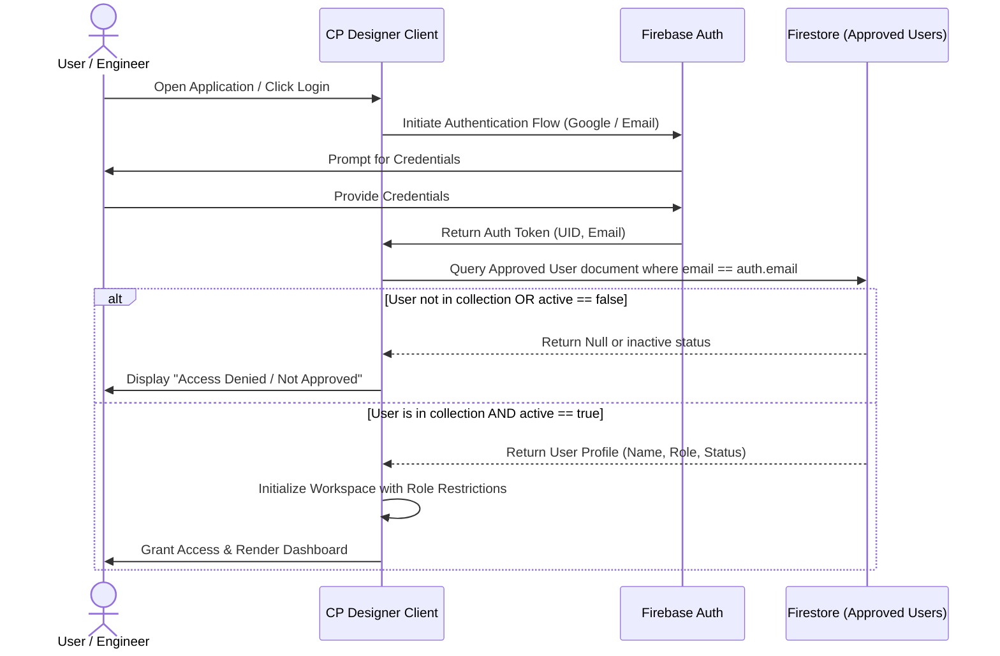

# User Access & Authorization Architecture

This document defines the security model and user authorization architecture for the **CP Designer** platform. It describes the integration of **Firebase Authentication** with a custom **Firestore Approved User Registry** to implement Role-Based Access Control (RBAC).

---

## 1. Security Architecture Overview

To ensure that only authorized IKK Group engineers and partners can access the CP calculations and BOM details, the platform uses a dual-layer security check:
1.  **Identity Layer (Firebase Auth)**: Authenticates the user's identity via Google Sign-In or Email/Password.
2.  **Authorization Layer (Firestore Registry)**: Validates that the authenticated user's email exists in the approved users list, checks that their status is `active === true`, and retrieves their assigned role.



---

## 2. Firestore Schema: Approved Users Collection (`/users`)

The approved user registry is stored centrally in Firestore. The document ID is the user's email address (or their Firebase UID for faster lookups).

```json
{
  "uid": "fb-auth-uid-12345",
  "email": "engineer@ikkgroup.com",
  "name": "Ahmad Mansoor",
  "role": "Engineer",
  "active": true,
  "created_at": "2026-06-11T16:00:00Z",
  "modified_at": "2026-06-11T16:00:00Z",
  "modified_by": "admin@ikkgroup.com"
}
```

### Supported Roles:
*   **Admin**: Platform administrator. Can manage users in the registry, change roles, activate/deactivate users, and override system configurations.
*   **Manager**: Project supervisor. Can edit designs, save/restore scenarios, and edit project metadata. Cannot modify users.
*   **Engineer**: Calculating engineer. Can edit designs, run calculations, view BOM, and override values. Cannot delete pipeline nodes or edit users.
*   **Reviewer**: External auditor/client representative. Has read-only access to all dashboards, formulas, and BOMs. Cannot edit inputs or save scenarios.

---

## 3. Role-Based Access Control (RBAC) Matrix

The table below outlines what operations are allowed for each role:

| Feature / Operation | Admin | Manager | Engineer | Reviewer |
| :--- | :---: | :---: | :---: | :---: |
| **View Dashboards & Formulas** | ✅ | ✅ | ✅ | ✅ |
| **Inspect Calculations Traceability** | ✅ | ✅ | ✅ | ✅ |
| **Run Sensitivity Analysis (Read-Only)** | ✅ | ✅ | ✅ | ✅ |
| **Edit Pipeline/Station Configurations** | ✅ | ✅ | ✅ | ❌ |
| **Save / Restore Scenarios** | ✅ | ✅ | ❌ | ❌ |
| **Delete Pipelines or Stations** | ✅ | ✅ | ❌ | ❌ |
| **Edit Lookup Configurations Library** | ✅ | ❌ | ❌ | ❌ |
| **Manage Approved User Registry (CRUD)**| ✅ | ❌ | ❌ | ❌ |

---

## 4. UI/UX Implementation & Security Hooks

### 4.1 Login Guard
The main application is wrapped in an `AuthGuard` component:
*   If the user is unauthenticated, they are presented with a clean login screen.
*   If authenticated but not registered/active, they are shown an "Access Denied" screen requesting administrator approval.

### 4.2 UI Restriction Hooks
We define a custom React hook `useRole()` that returns the user's role and helper booleans:
```typescript
const { role, isAdmin, isManager, isEngineer, isReviewer, canEdit } = useRole();
```
In the UI, fields are disabled dynamically based on roles:
```tsx
<input 
  type="number" 
  value={soilResistivity}
  disabled={!canEdit} 
  className="glass-input disabled:opacity-50"
/>
```

---

## 5. Firestore Security Rules

To enforce this authorization model on the database layer, the following Firestore Security Rules are applied:

```javascript
rules_version = '2';
service cloud.firestore {
  match /databases/{database}/documents {
    
    // Helper function to check if user document is active
    function isApprovedUser() {
      return request.auth != null && 
        exists(/databases/$(database)/documents/users/$(request.auth.token.email)) &&
        get(/databases/$(database)/documents/users/$(request.auth.token.email)).data.active == true;
    }
    
    // Helper function to check roles
    function getUserRole() {
      return get(/databases/$(database)/documents/users/$(request.auth.token.email)).data.role;
    }

    // Users Collection rules
    match /users/{userEmail} {
      // Only Admins can create, update, or delete users
      allow read: if request.auth != null;
      allow write: if request.auth != null && getUserRole() == 'Admin';
    }

    // Projects and Designs Collection rules
    match /projects/{projectId} {
      allow read: if isApprovedUser();
      allow create, update: if isApprovedUser() && getUserRole() in ['Admin', 'Manager', 'Engineer'];
      allow delete: if isApprovedUser() && getUserRole() in ['Admin', 'Manager'];
    }
  }
}
```
