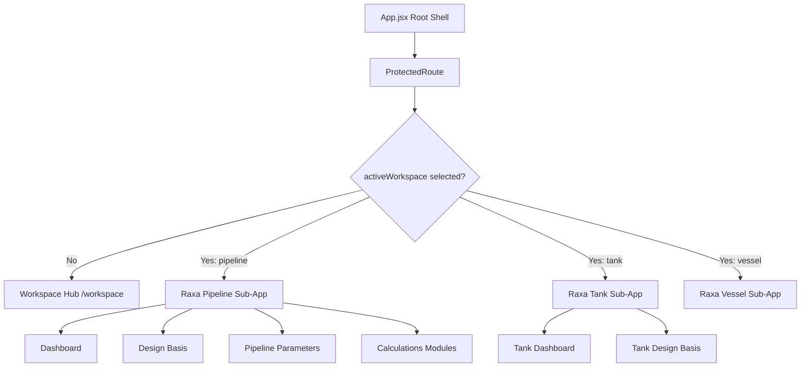

# RAXA Platform — Workspace & Modular Routing Architecture

This document establishes the architecture for the **RAXA Workspace Hub**—the central module selection portal—and details the future-proof routing strategy designed to scale to multiple engineering sub-applications without layout redesigns.

---

## 1. Modular Hierarchy & Architecture

RAXA serves as a unified suite hosting multiple specialized engineering modules. The root of the application acts as a clean shell responsible for Session Management (Auth), Global Theme, and Workspace Routing.



---

## 2. Workspace Registry & Portal Metadata

Rather than hardcoding workspace availability inside UI views, RAXA utilizes a central **Workspace Registry** at [workspaceRegistry.js](file:///home/rworld_pop/projects/PL%20PCP/cp-platform/src/config/workspaceRegistry.js) to dynamically configure modules. This allows the administrator to activate/deactivate modules or roll out new features without editing routing or dashboard markup.

### Registry Schema (`workspaceRegistry.js`)

```javascript
export const WORKSPACE_REGISTRY = {
  pipeline: {
    name: "Raxa Pipeline",
    enabled: true,
    description: "Impressed Current Cathodic Protection (ICCP) & Galvanic design for transmission pipelines.",
    icon: "Route"
  },
  tank: {
    name: "Raxa Tank",
    enabled: false,
    description: "Cathodic protection design for above-ground storage tank bottoms.",
    icon: "Layers"
  },
  vessel: {
    name: "Raxa Vessel",
    enabled: false,
    description: "Internal and external corrosion protection for pressure vessels and separators.",
    icon: "Database"
  },
  plant: {
    name: "Raxa Plant",
    enabled: false,
    description: "Complex grounding and cathodic protection grid analysis for industrial facilities.",
    icon: "Cpu"
  },
  survey: {
    name: "Raxa Survey",
    enabled: false,
    description: "CIS (Close Interval Survey) and DCVG data processing and visualization.",
    icon: "Signal"
  },
  integrity: {
    name: "Raxa Integrity",
    enabled: false,
    description: "Pipeline fitness-for-service (FFS), crack growth, and anomaly assessment.",
    icon: "Shield"
  }
};
```

### Dynamic Badge Mapping & Rendering

The Workspace Selection Dashboard (`PageWorkspace.jsx`) imports the registry and maps over its keys to render cards dynamically:

*   **Available**: If `enabled: true`, the workspace is selectable and links to the sub-app.
*   **Coming Soon**: If `enabled: false`, the card renders in a disabled style with a "Coming Soon" badge.

This design enables seamless scaling when new modules (such as Tank or Vessel) are activated—simply setting their `enabled` value to `true` activates them across the platform.

---


## 3. Global Routing & Layout Strategy

We implement a nested, conditional layout rendering strategy inside [App.jsx](file:///home/rworld_pop/projects/PL%20PCP/cp-platform/src/App.jsx) to ensure that future modules can slot in their own sidebars, headers, and workflows without code conflicts.

### AppShell Nested Layout Blueprint

```jsx
// App.jsx
function AppShell() {
  const activeWorkspace = useProjectStore((s) => s.activeWorkspace)
  const { pathname } = useLocation()
  
  const isWorkspacePortal = pathname === '/workspace' || !activeWorkspace

  // 1. Render Workspace Selection Portal (No Sidebar/Topbar)
  if (isWorkspacePortal) {
    return (
      <div className="portal-shell">
        <main className="portal-content">
          <Routes>
            <Route path="/workspace" element={<PageWorkspace />} />
            <Route path="*" element={<Navigate to="/workspace" replace />} />
          </Routes>
        </main>
      </div>
    )
  }

  // 2. Render Raxa Pipeline Module Shell (Dedicated Pipeline Sidebar/Topbar)
  if (activeWorkspace === 'pipeline') {
    return (
      <div className="app-shell">
        <Sidebar /> {/* Pipeline Navigation */}
        <div className="main-area">
          <TopBar /> {/* Pipeline Header Context */}
          <main className="page-content">
            <Routes>
              <Route path="/dashboard" element={<PageDashboard />} />
              <Route path="/project" element={<PageProjectSetup />} />
              <Route path="/pipeline" element={<PagePipeline />} />
              {/* Calculations and Reports Routes */}
            </Routes>
          </main>
        </div>
      </div>
    )
  }

  // 3. Render Future Raxa Tank Module Shell (Completely Independent Layout)
  if (activeWorkspace === 'tank') {
    return (
      <div className="tank-shell">
        <TankSidebar /> {/* Tank-Specific Navigation */}
        <div className="main-area">
          <TankTopBar />
          <main className="page-content">
            <Routes>
              <Route path="/tank/dashboard" element={<PageTankDashboard />} />
              {/* Tank Design routes */}
            </Routes>
          </main>
        </div>
      </div>
    )
  }

  return <Navigate to="/workspace" replace />
}
```

---

## 4. State Integration & Lifecycle Hooks

The active workspace state is managed via `useProjectStore` ([projectStore.js](file:///home/rworld_pop/projects/PL%20PCP/cp-platform/src/store/projectStore.js)):

1.  **Zustand Store Actions**:
    ```javascript
    activeWorkspace: null, // default value
    setActiveWorkspace: (workspace) => set((state) => {
      state.activeWorkspace = workspace
    })
    ```
2.  **State Persistence**:
    `activeWorkspace` is included in the `partialize` array in `localStorage` configuration. This preserves the selected workspace context across browser reloads so that engineers remain in their active workspace context.
3.  **Exit Workspace Hook**:
    Inside the sidebar layout, the RAXA platform brand header is clickable and triggers the reset sequence:
    ```javascript
    const handleExitWorkspace = () => {
      setActiveWorkspace(null) // Reset activeWorkspace state
      navigate('/workspace')   // Redirect to selection hub
    }
    ```
    This immediately clears the module's sidebar and returns the user to the central portal page.
