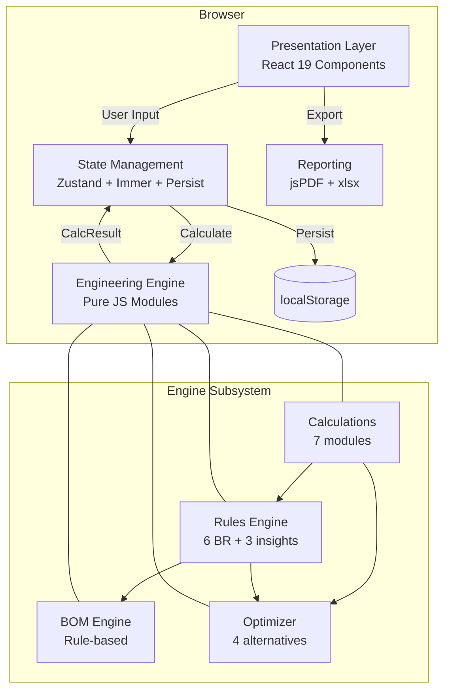
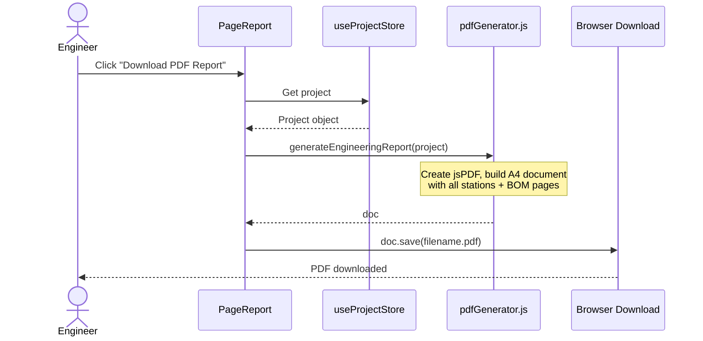

# Software Architecture Document

## CP Designer — Permanent ICCP Engineering Platform

**Version:** 1.0  
**Date:** June 2026  
**Project:** `/workspaces/PL_PCP/cp-platform`  
**Document Classification:** Technical Architecture

---

## 1. Folder Structure & Hierarchy Tree

```
cp-platform/
├── .claude/                      # Ruflo AI agent orchestration (added post-init)
│   ├── agents/                   # 17 specialized AI agents
│   ├── commands/                 # 16 command groups (slash commands)
│   ├── helpers/                  # Helper scripts
│   ├── skills/                   # 30 reusable skills
│   └── settings.json             # Hooks configuration (7 hook types)
├── .claude-flow/                 # Ruflo runtime data
│   ├── config.yaml               # Runtime configuration
│   ├── data/                     # Vector memory database
│   ├── hooks/                    # Custom hook scripts
│   ├── learning/                 # Self-learning loop data
│   └── sessions/                 # Session persistence
├── dist/                         # Production build output (Vite)
│   ├── assets/                   # Hashed JS/CSS bundles
│   ├── index.html                # Entry HTML
│   └── icons.svg / favicon.svg   # Static assets
├── public/                       # Static assets (served as-is)
│   ├── icons.svg                 # Lucide icon sprite
│   └── favicon.svg               # Favicon
├── src/                          # Main application source
│   ├── components/               # Layer 1: Shared UI primitives
│   │   ├── ui.jsx                # Reusable components (FieldInput, ResultRow, InsightCard, etc.)
│   │   └── layout.jsx            # Layout components (Sidebar, TopBar)
│   ├── constants/                # Layer 0: Engineering constants registry
│   │   └── index.js              # All constants: DESIGN_MODES, ANODE_SPECS, CABLE_SPECS, THRESHOLDS, STANDARDS
│   ├── engine/                   # Domain logic (pure functions, zero side effects)
│   │   ├── modules/              # Layer 4: Calculation modules
│   │   │   └── calculations.js   # 6 calculation modules + master orchestrator
│   │   ├── rules/                # Layer 3: Business rules engines
│   │   │   ├── rulesEngine.js    # 6 validation rules + proactive insights
│   │   │   └── bomEngine.js      # Rule-based BOM generation (per design mode)
│   │   └── optimizer/            # Layer 5: Design alternatives generator
│   │       └── optimizer.js      # 4 alternatives (+4 anodes, +8 anodes, larger TR, current)
│   ├── pages/                    # Layer 1: Page-level components
│   │   └── index.jsx             # 11 pages: ProjectSetup, Pipeline, CurrentRequirement, Groundbed, CableResistance, TRSizing, Validation, Optimizer, BOM, Report, Import
│   ├── reporting/                # Layer 8: Export/Import engines
│   │   ├── pdfGenerator.js       # Professional PDF engineering report (jsPDF)
│   │   └── excelEngine.js        # Multi-sheet XLSX export/import (xlsx)
│   ├── store/                    # Layer 2: State management
│   │   └── projectStore.js       # Zustand + Immer + persist (single source of truth)
│   ├── types/                    # Layer 0: Type definitions (JSDoc)
│   │   └── index.js              # All type definitions: Station, Project, CalcResult, BOMItem, etc.
│   ├── App.jsx                   # Root component, page routing, station tabs
│   ├── main.jsx                  # Entry point (React 19 + createRoot)
│   ├── index.css                 # Global styles, CSS custom properties
│   └── App.css                   # App-specific styles
├── index.html                    # Vite entry HTML
├── package.json                  # Dependencies & scripts
├── vite.config.js                # Vite configuration
├── eslint.config.js              # ESLint flat config
├── vercel.json                   # Vercel deployment config
├── netlify.toml                  # Netlify deployment config
├── nginx.conf                    # Nginx reverse proxy config
├── Dockerfile                    # Container build
└── README.md                     # Project documentation
```

---

## 2. Purpose of Every Folder and Major File

### Root Configuration Files

| File | Purpose |
|------|---------|
| `package.json` | Defines 26 dependencies (React 19, Zustand, Immer, Recharts, jsPDF, xlsx, Lucide, Zod, UUID) and 9 devDependencies (Vite 8, ESLint, React plugins) |
| `vite.config.js` | Vite 8 config: React plugin, ES modules, build output to `/dist` |
| `eslint.config.js` | Flat ESLint config with React hooks & refresh plugins |
| `vercel.json` | SPA routing rewrite for Vercel deployment |
| `netlify.toml` | SPA routing + build command for Netlify |
| `nginx.conf` | Nginx config: serve `/dist`, SPA fallback to `index.html` |
| `Dockerfile` | Multi-stage: Node 20 build → Nginx Alpine runtime on port 80 |

### Source Code — Layer 0: Foundation

| File | Purpose |
|------|---------|
| `src/constants/index.js` | **Engineering Constants Registry** — Single source of truth for all parameters. Contains: DESIGN_MODES (6 modes, 2 active), ANODE_SPECS (4 types), CABLE_SPECS (7 sizes), COATING_TYPES (4), SOIL_CLASSIFICATIONS (5), THRESHOLDS (12 engineering limits), STANDARDS (7 references), WORKFLOW_STATUSES (7 states) |
| `src/types/index.js` | **Type Definitions (JSDoc)** — 18 typedefs covering DesignMode, WorkflowStatus, ValidationCheck, EngineeringInsight, BOMItem, DesignAlternative, Revision, PipelineSegment, GroundbedConfig, AnodeSpec, CableConfig, TRSpec, Station, Project, CalcResult. No TypeScript — pure JSDoc for IDE support without compilation |

### Source Code — Layer 1: Presentation

| File | Purpose |
|------|---------|
| `src/components/ui.jsx` | **UI Primitive Library** — 15 reusable components: FieldInput, SelectField, ResultRow, CheckRow, InsightCard, StatCard, SectionCard, WorkflowStepper, InfoBox, Divider, Grid2/Grid3, StatusBadge, plus Lucide icon exports |
| `src/components/layout.jsx` | **Layout Shell** — Sidebar (navigation + station tabs), TopBar (project info + actions) |
| `src/pages/index.jsx` | **11 Page Components** (2,800+ lines): |
| | • `PageProjectSetup` — Client info, system config, station management |
| | • `PagePipeline` — Pipeline geometry, operating conditions, soil, remoteness |
| | • `PageCurrentRequirement` — Current calculation results per station |
| | • `PageGroundbed` — Groundbed config (deepwell/shallow), anode specs, results |
| | • `PageCableResistance` — Anode tail cables (per-anode grid), main cables, total R_c |
| | • `PageTRSizing` — TR ratings, circuit analysis, V_min, power calculations |
| | • `PageValidation` — All validation checks, insights, workflow advancement |
| | • `PageOptimizer` — Design alternatives comparison with apply action |
| | • `PageBOM` — Rule-generated BOM (gated by workflow status) |
| | • `PageReport` — Project summary, station summaries, PDF/Excel export, revisions |
| | • `PageImport` — Excel import with drag-drop, parsing, error handling |

### Source Code — Layer 2: State Management

| File | Purpose |
|------|---------|
| `src/store/projectStore.js` | **Zustand + Immer + Persist Store** (286 lines) — Single source of truth. Manages: Project CRUD, Station CRUD, Segment updates, Calculations (triggers engine), Workflow (7 states), Revisions (snapshots), UI state (active page, sidebar). Selectors for derived state. Persists only `project` + `activeStationId` to localStorage. |

### Source Code — Layer 3: Rules Engine

| File | Purpose |
|------|---------|
| `src/engine/rules/rulesEngine.js` | **Validation & Insight Engine** (283 lines) — 6 validation rules (BR-001 to BR-006) producing PASS/FAIL/WARNING checks + engineering insights. 3 proactive insight rules (high soil resistivity, TR headroom, high temperature). Returns `{checks, insights, allPassed}` |
| `src/engine/rules/bomEngine.js` | **Rule-Based BOM Generator** (309 lines) — Generates BOM from rules, not fixed tables. Per design mode: deepwell (anodes, coke, vent, cement, centralizers) vs shallow (anodes, coke per hole). Always: TRU, cables, junction boxes, test stations, misc. Returns `BOMItem[]` |

### Source Code — Layer 4: Calculation Modules

| File | Purpose |
|------|---------|
| `src/engine/modules/calculations.js` | **Pure Calculation Engine** (345 lines) — 6 modules + orchestrator: |
| | 1. `calcSurfaceArea` — π × D × L |
| | 2. `calcTempCorrectedCurrentDensity` — NACE SP0169: i_T = i_base × [1 + (T-25)×0.025] |
| | 3. `calcCurrentRequirement` — Σ(A_i × i_T_i) × 1.30 spare factor |
| | 4. `calcGroundbedResistance` — Dwight (deepwell) / Sunde (shallow vertical) |
| | 5. `calcCableResistances` — Parallel anode tails + series main cables |
| | 6. `calcTRCircuit` — R_T = R_G + R_c + R_emf + R_s; V_min = R_T × I + V_emf |
| | 7. `calcDesignLife` — Y = (N × W) / (C × I) |
| | **Orchestrator:** `runStationCalculations(station, designLifeYears)` → `CalcResult` |

### Source Code — Layer 5: Optimizer

| File | Purpose |
|------|---------|
| `src/engine/optimizer/optimizer.js` | **Design Alternatives Generator** (121 lines) — Creates 4 alternatives after each calculation: Current (baseline), +4 anodes, +8 anodes, Larger TR (next standard size). Each includes advantages/disadvantages, full recalculation, rule evaluation. |

### Source Code — Layer 8: Reporting

| File | Purpose |
|------|---------|
| `src/reporting/pdfGenerator.js` | **Professional PDF Report** (432 lines, jsPDF) — A4 portrait, branded header/footer, 6 sections per station (Pipeline, Current, Groundbed, Cable, TR Circuit, Validation), BOM tables, standards references, revision history. Color-coded PASS/FAIL/WARN. Auto page breaks. |
| `src/reporting/excelEngine.js` | **Multi-Sheet Excel Import/Export** (394 lines, xlsx) — Export: Summary, Station-N Inputs, Station-N Results, BOM (all stations), Revisions. Import: Detects own format (Summary sheet) or generic PCP workbook. Maps to project + station structure. |

---

## 3. Frontend Architecture Pattern

### Pattern: **Domain-Driven Modular Layered Architecture (DDMLA)** — 8 Layers

```
Layer 0: Constants & Types          → src/constants/, src/types/
Layer 1: Presentation (UI/Pages)    → src/components/, src/pages/
Layer 2: State Management           → src/store/
Layer 3: Business Rules             → src/engine/rules/
Layer 4: Pure Calculations          → src/engine/modules/
Layer 5: Optimization               → src/engine/optimizer/
Layer 6: (Reserved) Integration     → src/integration/ (future)
Layer 7: (Reserved) API/AI          → src/integration/ (future)
Layer 8: Reporting/Export           → src/reporting/
```

### Key Characteristics

| Aspect | Implementation |
|--------|----------------|
| **Framework** | React 19 (functional components, hooks) |
| **Build Tool** | Vite 8 (ESM, HMR, fast builds) |
| **Routing** | React Router 7 (`BrowserRouter`, `NavLink`) |
| **Styling** | CSS Custom Properties + utility classes in `index.css`/`App.css` |
| **Icons** | Lucide React (tree-shaken) + custom SVG sprite |
| **Charts** | Recharts (wired, used in Validation/Optimizer pages) |
| **State** | Zustand + Immer (mutable-style immutable updates) + persist middleware |
| **Type Safety** | JSDoc typedefs (no TypeScript compilation step) |

### Component Architecture

```
App.jsx (Root)
├── Sidebar (station tabs, navigation)
├── TopBar (project info, actions)
└── Main Area
    └── ActivePage (1 of 11)
        ├── SectionCard (container)
        │   ├── FieldInput / SelectField (controlled inputs → store actions)
        │   ├── ResultRow / StatCard (read-only derived state)
        │   ├── CheckRow / InsightCard (validation/insight display)
        │   └── WorkflowStepper / StatusBadge (workflow visualization)
        └── Grid2 / Grid3 (layout)
```

---

## 4. Backend Architecture Pattern

**No traditional backend exists.** This is a **client-side only SPA** (Single Page Application).

| Category | Status |
|----------|--------|
| **Backend** | None (fully client-side) |
| **API Layer** | None |
| **Database** | localStorage (via Zustand persist) + in-memory |
| **Authentication** | None |
| **Authorization** | Workflow-status-based (UI gating only) |
| **Server-Side Rendering** | None |

### Deployment Targets (Static Hosting)

| Platform | Config | Serving |
|----------|--------|---------|
| **Netlify** | `netlify.toml` | Drag-drop `/dist` or CLI |
| **Vercel** | `vercel.json` | Drag-drop `/dist` or CLI |
| **Nginx** | `nginx.conf` | Static file server + SPA fallback |
| **Docker** | `Dockerfile` | Multi-stage: Node build → Nginx Alpine |

### Why No Backend?

- Engineering calculations are **pure, deterministic, stateless** — run identically anywhere
- No user accounts, multi-tenancy, or shared data requirements
- Data persistence via **localStorage** (Zustand persist) — survives browser sessions
- **Export/Import** (PDF, Excel) provides portability and audit trail
- **Revision snapshots** stored in-project — full history without server

---

## 5. State Management Flow

### Store Architecture: `useProjectStore` (Zustand + Immer + Persist)

```javascript
// State Shape
{
  project: Project,           // Full project + all stations
  activeStationId: string,    // Currently selected station
  ui: {
    activePage: string,       // Current page key
    sidebarCollapsed: boolean,
    calculatingStationId: string | null
  }
}
```

### Persistence Strategy

```javascript
persist(
  immer((set, get) => ({ ... })),
  {
    name: 'cp-platform-project',
    version: 1,
    partialize: (state) => ({ 
      project: state.project, 
      activeStationId: state.activeStationId 
    })
  }
)
```

### Action Categories

| Category | Actions | Side Effects |
|----------|---------|--------------|
| **Project** | `updateProject`, `newProject` | `updatedAt` timestamp |
| **Station** | `setActiveStation`, `addStation`, `removeStation`, `updateStation`, `updateSegment` | `lastCalcResult = null`, `updatedAt` |
| **Calculation** | `calculateStation`, `calculateAllStations` | Runs engine, updates results |
| **BOM** | `getBOMForStation` | Reads `lastCalcResult`, checks workflow status |
| **Workflow** | `advanceWorkflow` | Updates status, notes, timestamp |
| **Revision** | `createRevision` | Deep clones project → `revisions[]` |
| **UI** | `setActivePage`, `setSidebarCollapsed` | Not persisted |
| **Selectors** | `getActiveStation`, `getTotalValidationFailCount`, `getAllStationsCalculated` | Derived state |

---

## 6. Data Flow: UI → Business Logic → Storage

```
User Input (FieldInput/SelectField/Button)
    │
    ▼
Store Action (updateStation / calculateStation / advanceWorkflow)
    │
    ├──→ Immer draft mutation (immutable update)
    │
    ├──→ Calculation Pipeline:
    │       runStationCalculations(station, life)
    │       ├── calcCurrentRequirement()
    │       ├── calcGroundbedResistance() [Dwight / Sunde]
    │       ├── calcCableResistances()
    │       ├── calcTRCircuit()
    │       └── calcDesignLife()
    │       └──→ CalcResult (38 fields)
    │
    ├──→ Rules Pipeline:
    │       runRules(station, result)
    │       ├── 6 validation checks (BR-001 → BR-006)
    │       └── 3 proactive insights
    │       └──→ {checks[], insights[], allPassed}
    │
    ├──→ Optimizer:
    │       generateAlternatives(station, result, life)
    │       └──→ DesignAlternative[4]
    │
    ├──→ BOM Engine (if status allows):
    │       generateBOM(station, result)
    │       └──→ BOMItem[]
    │
    ▼
State Update: station.lastCalcResult = result, status = 'calculated', project.updatedAt = now
    │
    ▼
localStorage: Persist { project, activeStationId }
    │
    ▼
UI Re-render (Zustand selectors fire → components update)
```

---

## 7. Database/Schema Structure

### No Traditional Database — Client-Side Schema

#### Primary Storage: localStorage (Zustand Persist)

```json
{
  "state": "cp-platform-project",
  "version": 1,
  "state": {
    "project": { /* Project object */ },
    "activeStationId": "uuid-string"
  }
}
```

#### Core Entity Schemas

**Project:**
```javascript
{ id, projectNumber, clientName, endClient, projectName, designer,
  createdAt, updatedAt, status, systemDesignLifeYears, stations[],
  revisions[], currentRevision }
```

**Station:**
```javascript
{ id, name, location, designMode, pipelineSegments[], groundbed,
  anodeSpec, proposedAnodes, cables, tr, soilResistivityOhmCm,
  actualRemotenesM, requiredRemotenesM, designLifeYears, status,
  lastCalcResult, insights[], alternatives[] }
```

**CalcResult (38 fields):**
```javascript
{ stationId, calculatedAt, totalSurfaceAreaM2, tempCorrectedCurrentDensity,
  requiredCurrentA, designCurrentA, groundbedResistanceOhm, activeLengthM,
  totalDrillDepthM, anodeTailParallelResOhm, posMainCableResOhm,
  negMainCableResOhm, totalCableResOhm, backEMFResistanceOhm,
  totalCircuitResistanceOhm, minTRVoltage, maxAllowableGroundbedRes,
  maxCircuitRes70pct, maxCircuitRes90pct, dcPowerW, acInputKVA,
  acInputCurrentA, designLifeYears, targetDesignLifeYears,
  perSegmentCurrents[], checks[], allChecksPassed, insights[], bom[] }
```

---

## 8. API Integrations and Dependencies

### External API Integrations: **None**

| Package | Version | Purpose |
|---------|---------|---------|
| `react` | ^19.2.6 | UI framework |
| `react-dom` | ^19.2.6 | DOM rendering |
| `zustand` | ^5.0.14 | State management |
| `immer` | ^11.1.8 | Immutable updates |
| `jspdf` | ^4.2.1 | PDF generation |
| `jspdf-autotable` | ^5.0.8 | PDF tables |
| `xlsx` | ^0.18.5 | Excel import/export |
| `recharts` | ^3.8.1 | Charts |
| `lucide-react` | ^1.17.0 | Icons |
| `uuid` | ^14.0.0 | Unique IDs |
| `zod` | ^4.4.3 | Schema validation (unused) |
| `date-fns` | ^4.4.0 | Date formatting |

---

## 9. Authentication and Authorization Flow

**Current State: None implemented.**

| Aspect | Implementation |
|--------|----------------|
| **Authentication** | ❌ None — no login, no users, no sessions |
| **Authorization** | ❌ None — no roles, no permissions |
| **Access Control** | Workflow-status-based UI gating only (client-side) |
| **Data Isolation** | ❌ None — single localStorage key per browser |

### Workflow Statuses

| Status | Order | BOM Access |
|--------|-------|------------|
| `draft` | 0 | ❌ |
| `input_complete` | 1 | ❌ |
| `calculated` | 2 | ❌ |
| `engineering_review` | 3 | ❌ |
| `optimized` | 4 | ❌ |
| `approved` | 5 | ✅ |
| `issued_for_construction` | 6 | ✅ |

---

## 10. Calculation/Engineering Engine Architecture

### Engine Philosophy

> **Pure, stateless, side-effect-free functions.** Every function is independently unit-testable. Zero DOM access. Zero state mutation.

### Calculation Modules

| Module | Function | Formula / Standard |
|--------|----------|-------------------|
| Surface Area | `calcSurfaceArea(od, lengthM)` | A = π × D × L |
| Current Density | `calcTempCorrectedCurrentDensity(base, tempC)` | i_T = i_base × [1 + (T-25)×0.025] |
| Current Requirement | `calcCurrentRequirement(segments[])` | I_req = Σ(A_i × i_T_i) × 1.30 |
| Deepwell R_G | `calcDweellGroundbedResistance(ρ, L, d, h)` | Dwight: R_G = ρ/(2πL) × (ln(8L/d) - 1 + L/4h) |
| Shallow R_G | `calcShallowVerticalGroundbedResistance(ρ, L, d, h, N, S)` | Sunde: Parallel with mutual interference |
| Cable Resistances | `calcCableResistances(cables, N)` | Parallel tails + series mains |
| TR Circuit | `calcTRCircuit(R_G, R_c, V_emf, R_s, V_rated, I_rated)` | R_T = R_G + R_c + R_emf + R_s; V_min = R_T×I + V_emf |
| Design Life | `calcDesignLife(N, W, C, I)` | Y = (N × W) / (C × I) |

### Validation Rules

| Rule | Check | Formula |
|------|-------|---------|
| BR-001 | TR Voltage Adequate | `V_rated ≥ V_min` |
| BR-002 | Groundbed R < Max Allowable | `R_G < R_G_max` |
| BR-003 | Circuit R < 70% Operating | `R_T < 0.70 × (V/I)` |
| BR-004 | Circuit R < 90% Warning | `R_T < 0.90 × (V/I)` |
| BR-005 | Design Life ≥ Target | `Y ≥ target` |
| BR-006 | Remoteness Check | `actual ≥ 20m` |

---

## 11. Report Generation Architecture

### PDF Generator (`pdfGenerator.js` — jsPDF)

```
Page 1: Cover + Project Summary + Station Table + Standards
Pages 2-N: Per-Station Detail (6 sections each)
  - Pipeline Parameters
  - Current Requirement Calculation
  - Groundbed Design (Dwight/Sunde formulas)
  - Cable Resistance Calculation
  - TR Circuit Analysis
  - Validation Checks (color-coded PASS/FAIL/WARN)
Pages N+: BOM Tables per station
```

### Excel Engine (`excelEngine.js` — xlsx)

| Sheet | Content |
|-------|---------|
| Summary | Project info + station summary table |
| Station-N Inputs | All input parameters |
| Station-N Results | All 38 CalcResult fields + validation |
| BOM | All stations' BOM combined |
| Revisions | Revision history table |

---

## 12. Deployment Architecture

### Build Process

```bash
npm run build    # Vite production build → /dist
```

### Deployment Options

| Platform | Command | Notes |
|----------|---------|-------|
| Netlify | `netlify deploy --dir=dist --prod` | SPA redirect, auto HTTPS |
| Vercel | `vercel --prod` | SPA rewrite, edge network |
| Nginx | Copy `/dist` to web root | `try_files $uri $uri/ /index.html` |
| Docker | `docker build -t cp-platform . && docker run -p 80:80 cp-platform` | Multi-stage: Node 20 → Nginx Alpine |

**No environment variables required.** Fully client-side, zero runtime config.

---

## 13. Scalability and Maintainability Assessment

### Scalability

| Dimension | Assessment |
|-----------|------------|
| Stations per Project | ✅ Unlimited (localStorage ~5MB limit) |
| Pipeline Segments/Station | ⚠️ Limited (single segment hardcoded) |
| Calculation Performance | ✅ <100ms/station |
| Bundle Size | ✅ ~500KB JS gzipped |
| Concurrent Users | ❌ Single-user (localStorage) |

### Maintainability Strengths

| Aspect | Score | Evidence |
|--------|-------|----------|
| Separation of Concerns | 9/10 | 8-layer DDMLA, pure functions, no UI in engine |
| Testability | 9/10 | All engine functions pure, zero dependencies |
| Type Safety | 7/10 | JSDoc typedefs (no compile-time checking) |
| Documentation | 8/10 | Inline JSDoc, README, constant references |
| Consistency | 8/10 | Uniform patterns across pages, components |

### Technical Debt

| Item | Severity | Description |
|------|----------|-------------|
| No TypeScript | High | No compile-time safety |
| Integration Tests | High | No CI verification (Unit tests complete) |
| Revision Deep Clones | Medium | Storage grows quadratically |
| No Undo/Redo | Medium | Immer supports but not exposed |

---

## 14. Architecture Diagram (Mermaid)



---

## 15. Sequence Diagram: Calculate Station

```mermaid
sequenceDiagram
    actor Engineer
    participant UI as Page
    participant Store as Zustand Store
    participant Calc as calculations.js
    participant Rules as rulesEngine.js
    participant Opt as optimizer.js
    
    Engineer->>UI: Click "Run Calculations"
    UI->>Store: calculateStation(id)
    Store->>Calc: runStationCalculations(station, life)
    Calc-->>Store: CalcResult
    Store->>Rules: runRules(station, result)
    Rules-->>Store: {checks, insights, allPassed}
    Store->>Opt: generateAlternatives(station, result, life)
    Opt->>Calc: recalculate (x3)
    Opt-->>Store: DesignAlternative[4]
    Store->>Store: Update state
    Store-->>UI: Re-render with results
```

---

## 16. Sequence Diagram: Export PDF



---

## 17. Recommendations for Enterprise-Grade Improvements

### Priority 1: Critical

| # | Recommendation | Impact |
|---|----------------|--------|
| 1.1 | **Add Authentication** (Auth0/Azure AD) | Multi-user, audit trails |
| 1.2 | **Implement RBAC** (Engineer, Reviewer, Approver) | Enforce workflow |
| 1.3 | **Backend API** (Node.js/Go) | Multi-user, cloud sync |
| 1.4 | **Immutable Audit Log** | Regulatory compliance |
| 1.5 | **Data Encryption** (IndexedDB + AES-256) | Data protection |

### Priority 2: High

| # | Recommendation | Impact |
|---|----------------|--------|
| 2.1 | **Migrate to TypeScript** | Compile-time safety |
| 2.2 | **Integration Tests** (Playwright) | E2E verification |
| 2.3 | **Revision Compression** | Storage efficiency |

### Priority 3: Medium

| # | Recommendation | Impact |
|---|----------------|--------|
| 3.1 | **IndexedDB Storage** (replace localStorage) | 500MB+ capacity |
| 3.2 | **Undo/Redo** | UX improvement |
| 3.3 | **Tank Bottom ICCP Mode** | New capability |
| 3.4 | **Plant Piping ICCP Mode** | New capability |

### Priority 4: Low

| # | Recommendation | Impact |
|---|----------------|--------|
| 4.1 | **Storybook** | Component documentation |
| 4.2 | **PWA Support** | Offline capability |
| 4.3 | **Dark Mode** | UX polish |

---

## Appendix: Engineering Standards Implemented

| Standard | Reference | Implementation |
|----------|-----------|----------------|
| NACE SP0169 | CP of Underground Metallic Piping Systems | Current density temp correction |
| 17-SAMSS-003 | TR Unit specification | TR ratings, oil cooling, RMU |
| 17-SAMSS-016 | Anode specification | HSCI TA-4/TA-2 specs |
| 17-SAMSS-008 | Junction box specification | 12/20-terminal SS316L NEMA4X |
| Dwight (1936) | Deepwell groundbed resistance | R_G = ρ/(2πL) × (ln(8L/d) - 1 + L/4h) |
| Sunde (1968) | Shallow vertical parallel | R_G = (R_single/N) × F_spacing |
| IEC 60287 | Cable ampacity | Max current ratings per size |

---

**Document End**
