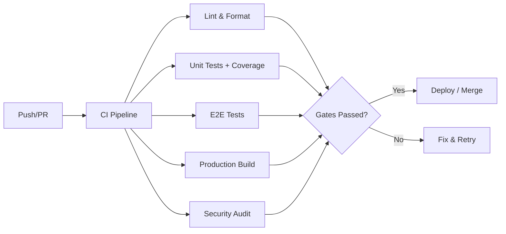

# Development Guide — CP Designer ICCP Engineering Platform

## Project Structure

```
cp-platform/
├── .devcontainer/          # Codespaces / Dev Container config
├── .github/workflows/      # CI/CD pipelines
├── src/
│   ├── components/         # Reusable UI components
│   │   ├── layout.jsx      # Shell layout (Sidebar, TopBar)
│   │   └── ui.jsx          # 15 UI primitives
│   ├── constants/           # Engineering constants & registries
│   ├── engine/              # Domain logic (pure functions)
│   │   ├── modules/         # 7 calculation modules
│   │   ├── rules/           # Business rules + BOM engine
│   │   ├── optimizer/       # Design alternatives
│   │   └── __tests__/       # Golden dataset tests
│   ├── pages/               # 11 page components
│   ├── reporting/           # PDF + Excel export
│   ├── store/               # Zustand state management
│   ├── test-utils/          # Verification framework
│   ├── e2e/                 # Playwright E2E tests
│   └── types/               # JSDoc type definitions
├── scripts/
│   ├── setup.sh             # Fresh environment setup
│   └── doctor.mjs           # Environment health check
├── docs/                    # MkDocs documentation
├── dist/                    # Production build output
├── coverage/                # Test coverage reports
├── .prettierrc              # Prettier configuration
├── eslint.config.js         # ESLint flat config
├── vite.config.js           # Build configuration
├── vitest.config.js         # Test configuration
├── playwright.config.js     # E2E test configuration
├── tsconfig.json            # TypeScript migration readiness
├── mkdocs.yml               # Documentation configuration
├── Dockerfile               # Container deployment
├── nginx.conf               # Nginx + security headers
└── package.json             # Dependencies & scripts
```

## Architecture

### 8-Layer DDMLA (Domain-Driven Modular Layered Architecture)

```
Layer 0: Foundation       constants/, types/
Layer 1: Presentation     components/, pages/
Layer 2: State            store/ (Zustand + Immer)
Layer 3: Business Rules   engine/rules/
Layer 4: Calculations     engine/modules/ (pure, stateless)
Layer 5: Optimization     engine/optimizer/
Layer 8: Reporting        reporting/ (PDF, Excel)
```

**Key principles:**
- **Pure functions** for all calculations — no side effects, fully testable
- **Unidirectional data flow** — UI → Store → Engine → Store → UI
- **Immutable state** — Zustand + Immer ensures predictable updates
- **No backend** — Fully client-side SPA

## Development Workflow

### Branch Strategy

```
main        ── Production releases
  └─ develop ── Integration branch
       ├─ feature/xxx   ── New features
       ├─ fix/xxx       ── Bug fixes
       └─ refactor/xxx  ── Code improvements
```

### Code Quality Gates

Every PR must pass:
1. `npm run format:check` — Prettier
2. `npm run lint` — ESLint (zero errors)
3. `npm run test:coverage` — All tests + coverage
4. `npm run build` — Production build

## Testing Strategy

| Level | Tool | Scope | Location |
|-------|------|-------|----------|
| Unit | Vitest | Individual functions | `src/**/*.test.js` |
| Integration | Vitest | Module orchestration | `src/engine/__tests__/*.test.js` |
| Golden Dataset | Vitest | Regression against reference | `src/engine/__tests__/goldenDatasets.test.js` |
| E2E | Playwright | Critical user paths | `src/e2e/*.spec.js` |
| Precision | Decimal.js | IEEE 754 safety | `src/engine/__tests__/decimalPrecision.test.js` |

## Golden Datasets

Pre-computed reference values ensure calculations never regress:

```
Dataset 1: Deepwell Tie-In     → 14 output fields verified
Dataset 2: Deepwell Main Line  → 3 output fields verified
```

Run: `npm test -- --grep "Golden Dataset"`

## Code Style

- **Formatting**: Prettier (semicolons off, single quotes, trailing commas)
- **Linting**: ESLint flat config (React hooks, import rules)
- **Types**: JSDoc in `.js` files (migrating to `.ts` eventually)

## Documentation

```bash
npm run docs:build   # Build static documentation site
npm run docs:serve   # Serve at http://localhost:8000
```

Docs use MkDocs Material with Mermaid for diagrams.

## CI/CD Pipeline



## Known Issues

| Issue | Impact | Status |
|-------|--------|--------|
| Coating efficiency not applied in current calc | Underestimates current demand | Tracked |
| xlsx prototype pollution CVE (no fix) | Low risk (client-only usage) | Accepted |
| Large reporting chunk (842KB) | Slow initial load | Optimize with dynamic import |

## Release Process

```bash
# 1. Update version
npm version patch|minor|major

# 2. Push with tags
git push --follow-tags

# 3. CI builds and creates GitHub Release
```
