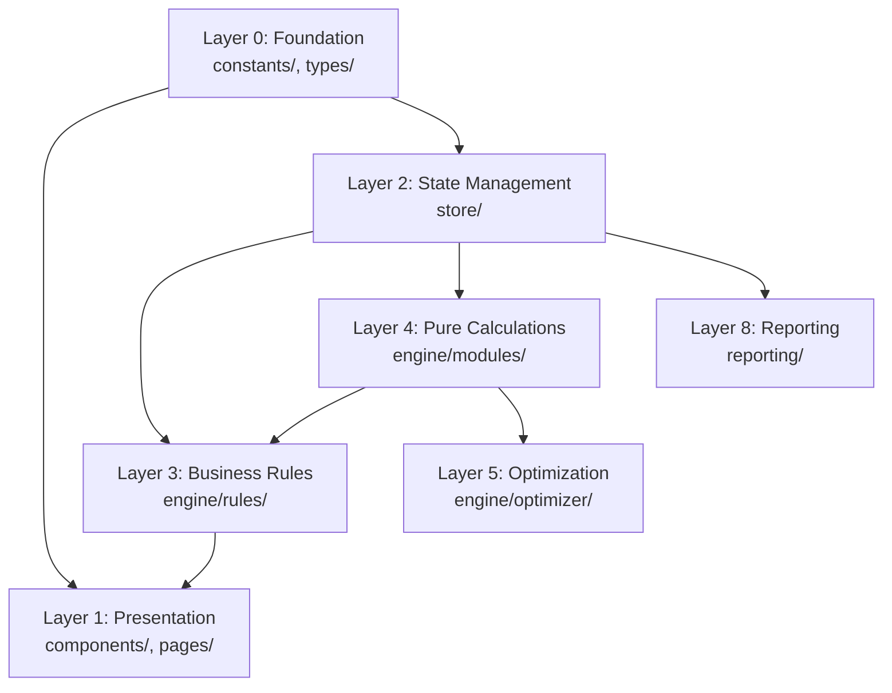

# Architecture Overview

The CP Platform uses an **8-Layer Domain-Driven Modular Layered Architecture (DDMLA)**:

## Layer Responsibilities

| Layer | Directory | Responsibility |
|-------|-----------|----------------|
| 0 | `constants/`, `types/` | Engineering constants, type definitions |
| 1 | `components/`, `pages/` | UI components and page views |
| 2 | `store/` | Zustand state management, persistence |
| 3 | `engine/rules/` | Business rules, BOM generation, insights |
| 4 | `engine/modules/` | Pure calculation functions (no side effects) |
| 5 | `engine/optimizer/` | Design alternatives, trade-off analysis |
| 8 | `reporting/` | PDF, Excel export/import |

## Key Design Decisions

- **Pure functions** for all calculations (testable, verifiable)
- **Unidirectional data flow** via Zustand store
- **Immutable state updates** via Immer
- **No backend** — fully client-side SPA
- **Zod schemas** for runtime validation
