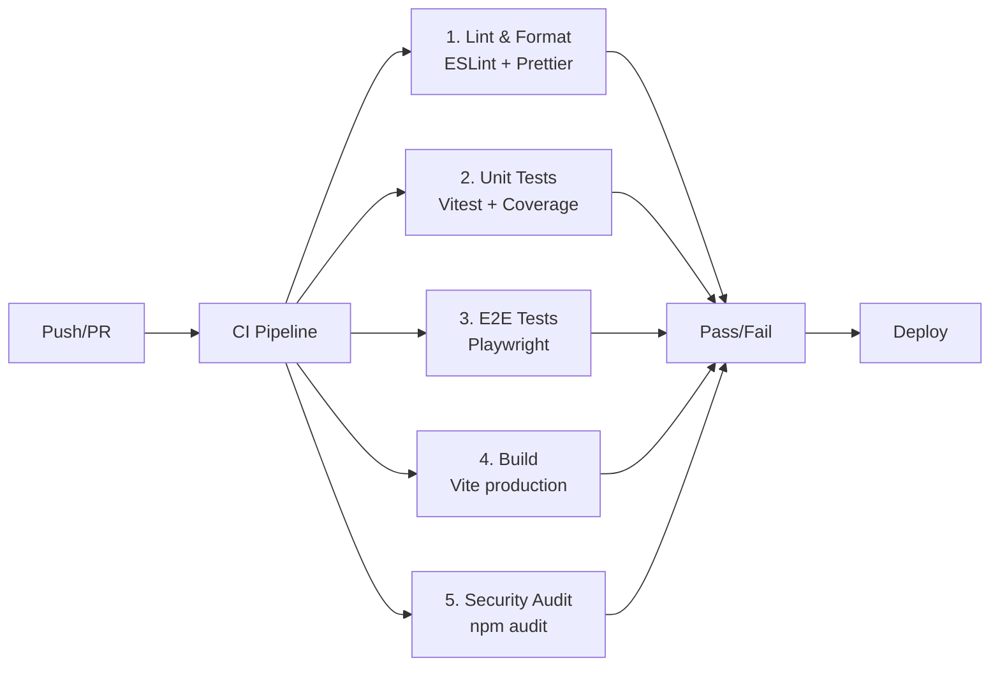

# CI/CD Pipeline

## GitHub Actions Workflows

## Workflows

### `ci.yml`
Runs on push to `main`/`develop` and PRs:
- Lint & Format check
- Unit tests with coverage (uploaded to Codecov)
- E2E tests (Playwright with Chromium)
- Production build validation
- Security audit (npm audit — high level)

### `release.yml`
Runs on version tags (`v*.*.*`):
- Full verification pipeline
- Production build
- GitHub Release with artifacts
- GitHub Pages deployment

### `dependency-audit.yml`
Weekly scheduled audit:
- npm audit (moderate+)
- Outdated dependency check
- GitHub Issue on critical vulnerabilities

## Quality Gates

| Gate | Requirement |
|------|-------------|
| Lint | Zero errors |
| Format | Prettier compliance |
| Unit Tests | All passing |
| E2E Tests | All passing |
| Build | Successful production build |
| Security | No high vulnerabilities |
