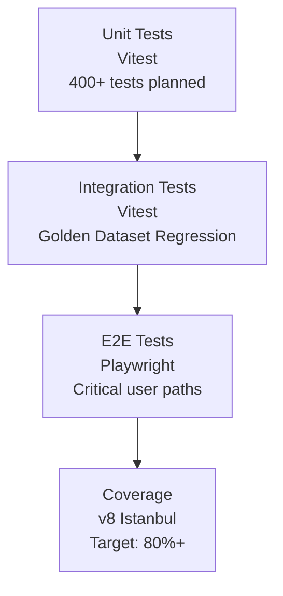

# Testing Strategy

## Test Levels



## Running Tests

```bash
# Unit + integration
npm test                 # Run once
npm run test:watch      # Watch mode
npm run test:coverage   # With coverage report

# E2E
npm run test:e2e        # Headless
npm run test:e2e:ui     # Interactive UI mode
npm run test:e2e:debug  # Debug mode

# All tests
npm run test:all
```

## Golden Dataset Testing

The framework verifies calculations against pre-computed reference values:

```
Dataset 1: Deepwell Tie-In    → 1118.43 m², 0.2019 A, 30.88 years
Dataset 2: Deepwell Main Line → 158877.93 m², 28.6854 A
```

Tolerances are field-specific:
- Electrical: ±0.5% or ±0.001Ω
- Dimensions: ±0.1% or ±0.01m²
- Life: ±0.1 years
- Current: ±0.5% or ±0.0001A
