# DEPENDENCY MAP — ICCP Calculation Variable Graph

> **Source:** Excel `Cal.(DW)` → Code `src/engine/modules/calculations.js`
> **Golden Dataset:** `src/engine/__tests__/goldenDatasets.test.js`
> **Generated:** June 2026
> **Related Documents:**
>   - [Formula Inventory](FORMULA_INVENTORY.md) — all formulas
>   - [Engineering Assumptions](ENGINEERING_ASSUMPTIONS.md) — design basis
>   - [Calculation Flow](CALCULATION_FLOW.md) — sequence diagram

## Notation

```
Variable ← Source [Type]  → Dependent(s)
  ↑                        ↓
Input/Constant         Used by (depends on me)
  │                        │
  └─── Data Flow ──────────┘

Types: [U] = User Input, [C] = Constant, [I] = Intermediate, [O] = Final Output
```

---

## 1. Pipeline Geometry

```
OD_inch [U] ──────────────────────────────────────────────────────────┐
  │ User: Outside diameter in inches                                    │
  ├──→ D_m = OD_inch × 0.0254                    [I] → Surface area    │
  │                                                                     │
WallThk_inch [U]                                                        │
  │ User: Wall thickness in inches             (display only)           │
  │                                                                     │
Length_m [U] ───────────────────────────────────────────────────────────┤
  │ User: Pipeline section length in meters                             │
  └──→ Surface area                                                     │
                                                                        │
                     ┌──────────────────────────────────────────────────┘
                     ▼
        A_m2 = π × D_m × Length_m            [I] calcSurfaceArea()
                     │
                     ├──→ Current requirement I_req
                     │
                     ▼
              BaseCD_mAm2 [U]
                │ User: Current density at 25°C (mA/m²)
                │
                Temp_op_C [U]
                │ User: Operating temperature (°C)
                │
                T_ref = 25°C [C] (THRESHOLDS.BASE_TEMP_C)
                │
                k_temp = 0.025 [C] (THRESHOLDS.TEMP_CORRECTION_FACTOR)
                │
                ├──→ i_T = BaseCD × [1 + (T-25) × 0.025]    [I]
                │         calcTempCorrectedCurrentDensity()
                │         │
                │         └──→ I_req_single_segment
                │
                CoatingEff = 0.98 [C/U] (code enhancement vs Excel)
                │
                └──→ I_req_seg = A × i_T / 1000 × CoatingEff   [I]
```

---

## 2. Current Requirement

```
I_req_seg (per segment) ────────────────────────────────────────────────┐
  │ Sum across all segments                                             │
  │                                                                     │
  ├──→ I_req_total = Σ(I_req_seg)                  [I]                  │
  │         │                                                           │
  │         SpareFactor = 1.30 [C] (THRESHOLDS.SPARE_FACTOR)            │
  │         │                                                           │
  │         ├──→ I_design = I_req_total × 1.30        [I]              │
  │         │         calcCurrentRequirement()                          │
  │         │         │                                                  │
  │         │         ├──→ Anode count calc (N_cur = ceil(I_design/Ia)) │
  │         │         ├──→ TR headroom check                            │
  │         │         └──→ (reported in UI + PDF)                       │
  │         │                                                           │
  │         └──→ (also: required current A)                             │
```

---

## 3. Anode Requirements

```
Ia_anode = 3.56A [C] (ANODE_SPECS.HSCI_TA4.outputAmps)
  │
  ├──→ N_current = ceil(I_design / Ia_anode)                     [I]
  │
  │ TR_Irated [U]
  │   │
  │   ├──→ N_tr = ceil(TR_Irated / Ia_anode)                     [I]
  │
  │ N_proposed [U]
  │   │ User: Proposed number of anodes (≥ max(N_current, N_tr))
  │   │
  │   ├──→ Groundbed resistance calculation                    ↓↓↓
  │   ├──→ Cable resistance calculation
  │   ├──→ Design life calculation
  │   └──→ BOM generation
```

---

## 4. Groundbed Resistance

### Deepwell Path

```
N_proposed [U] ─────────────────────────────────────────────────────────┐
  │                                                                     │
  │ AnodeLength_m [U]                                                   │
  │   │ User: Single anode length (TA-4 = 2.13m)                       │
  │   │                                                                 │
  │ AnodeSpacing_m [U]                                                  │
  │   │ User: End-to-end spacing (typically 1.5m)                       │
  │   │                                                                 │
  │ L_active = N × L_anode + (N-1) × Spacing              [I]          │
  │   │                                                                 │
  │ rho_OhmCm [U]                                                        │
  │   │ User: Soil resistivity (Ω·cm)                                    │
  │   │                                                                 │
  │ rho_OhmM = rho_OhmCm / 100                            [I]          │
  │   │                                                                 │
  │ BoreholeDia_m [U]                                                    │
  │   │                                                                 │
  │ StartDepth_m [U]                                                     │
  │   │                                                                 │
  │ h_mid = StartDepth + L_active/2                       [I]          │
  │   │                                                                 │
  │ ┌─────────────────────────────────────────────────────────────────┐ │
  │ │ R_G = ρ/(2πL) × [ln(8L/d) - 1 + L/(4h)]    [I] calcDwight()   │ │
  │ └─────────────────────────────────────────────────────────────────┘ │
  │   │                                                                  │
  │   ├──→ Total circuit resistance R_T                                │
  │   ├──→ R_G max allowable check                                     │
  │   └──→ Groundbed resistance PASS/FAIL                              │
  │                                                                     │
  │ TotalDrillDepth = StartDepth + L_active + CokeCover + CementPlug [I]│
```

### Shallow Vertical Path

```
N_proposed [U]
  AnodeLength_m [U]
  BoreholeDia_m [U]
  StartDepth_m [U]
  rho_OhmCm [U]
  Spacing_cc = AnodeLength + AnodeSpacing                  [I]

  R_single = ρ/(2πL) × [ln(4L/d) - 1 + L/(2h)]            [I]

  R_mutual = ρ/(π×L×N²) × Σ[ln(2i×S/L)]   for i=1..N-1    [I]
    │
    └──→ R_G = R_single/N + R_mutual                       [I]
           calcShallowVerticalGroundbedResistance()
```

---

## 5. Cable Resistance

```
AnodeTailLengths_[20] [U]
  │ User: Per-anode tail cable lengths (m)
  │
  CableSize_anode = 16mm² [U]
  │ r_16 = 1.673e-3 Ω/m [C] (CABLE_SPECS[16])
  │
  ├──→ R_i = L_i × r_16                for each anode      [I]
  ├──→ R_ac = 1 / Σ(1/R_i)                                 [I]
  │         calcAnodeTailParallelResistance()
  │
  PosMainLength [U]
  PosMainSize = 35mm² [U]
  │ r_35 = 6.59e-4 Ω/m [C] (CABLE_SPECS[35])
  │
  ├──→ R_pc = PosMainLength × r_35                         [I]
  │
  NegMainLength [U]
  NegMainSize = 35mm² [U]
  ├──→ R_nc_main = NegMainLength × r_35                    [I]
  │
  NegSecLength [U]
  NegSecSize = 25mm² [U]
  │ r_25 = 1.053e-3 Ω/m [C] (CABLE_SPECS[25])
  │
  ├──→ R_nc_sec = NegSecLength × r_25                      [I]
  │
  │ ┌─────────────────────────────────────────────────────┐
  │ │ R_c = R_ac + R_pc + R_nc_main + R_nc_sec    [I]     │
  │ │ calcCableResistances()                               │
  │ └─────────────────────────────────────────────────────┘
  │   │
  │   ├──→ Total circuit resistance R_T
```

---

## 6. TR Circuit Analysis

```
── From Groundbed ───────────────────────────────────────────────────────
R_G [I] ──────────────────────────────────────────────────────────────────┐
  │                                                                       │
── From Cables ───────────────────────────────────────────────────────────┤
R_c [I] ──────────────────────────────────────────────────────────────────┤
  │                                                                       │
── Back EMF ──────────────────────────────────────────────────────────────┤
V_emf [U]                                                                 │
  │ User: Back EMF (typically 2V)                                         │
  │                                                                       │
  TR_Irated [U]                                                           │
  │ User: TR rated current (A)                                            │
  │                                                                       │
  ├──→ R_emf = 2 × V_emf / TR_Irated                  [I] // Section 7 │
  │                                                                       │
── Structure ─────────────────────────────────────────────────────────────┤
R_struct [U]                                                               │
  │ User: Structure-to-earth resistance (Ω)                               │
  │                                                                       │
── TOTAL CIRCUIT ─────────────────────────────────────────────────────────┤
  │                                                                       │
  │ ┌─────────────────────────────────────────────────────────────────┐   │
  │ │ R_T = R_G + R_c + R_emf + R_struct            [O]              │   │
  │ └─────────────────────────────────────────────────────────────────┘   │
  │   │                                                                  │
  │   ├──→ Min TR voltage                                                 │
  │   │     V_min = R_T × TR_Irated + V_emf              [O]             │
  │   │                                                                  │
  │   ├──→ Max allowable R_G                                             │
  │   │     R_Gmax = 0.70 × (V_rated - V_emf) / I - R_c - R_struct  [O]  │
  │   │   ⚠️ CODE DISCREPANCY: EMF not subtracted in code                │
  │   │                                                                  │
  │   ├──→ Max circuit R (70%): R_Tmax70 = 0.70 × V_rated / I_rated [O] │
  │   ├──→ Max circuit R (90%): R_Tmax90 = 0.90 × V_rated / I_rated [O] │
  │   │                                                                  │
  │   TR_Vrated [U]                                                      │
  │   │ User: TR rated voltage (V)                                       │
  │   │                                                                  │
  │   ├──→ DC Power: P_DC = V_rated × I_rated            [O]            │
  │   ├──→ AC kVA: P_DC / (0.8 × 0.8 × 1000)            [O]            │
  │   ├──→ AC current: I_ac = kVA × 1000 / (480 × √3)    [O]            │
  │   ├──→ TR voltage check: V_rated ≥ V_min ?           [Rule BR-001]  │
  │   └──→ Circuit R check: R_T < R_Tmax70 ?             [Rule BR-003]  │
```

---

## 7. Design Life

```
N [U] (proposed anodes)
    │
W [C] (anode weight = 38.6 kg for HSCI TA-4)
    │
C_rate [C] (consumption rate = 0.45 kg/A·yr)
    │
TR_Irated [U]
    │
    ├──→ Y = N × W / (C_rate × TR_Irated)               [O]
    │         calcDesignLife()
    │         │
    │         ├──→ Y ≥ TargetYears ?                     [Rule BR-005]
    │         └──→ Y - TargetYears < 3yr margin?         [Rule BR-005 warn]
    │
    TargetYears = 25 [U] (from project settings)
```

---

## 8. Full Dependency Graph (Mermaid)

```mermaid
graph TD
    %% Inputs
    OD["OD (inch) [U]"] --> D["D (m)"]
    L["Length (m) [U]"] --> A["A = πDL"]
    BaseCD["Base CD [U]"] --> iT["i_T (temp corr)"]
    Temp["Temp (°C) [U]"] --> iT
    iT --> I_req["I_req = A × i_T"]
    A --> I_req
    CE["Coating Eff [U]"] --> I_req
    Spare["Spare 1.30 [C]"] --> I_design["I_design = I_req × 1.30"]
    I_req --> I_design

    %% Anode
    I_design --> N_cur["N by current"]
    Ia["Ia=3.56A [C]"] --> N_cur
    TR_I["TR I_rated [U]"] --> N_tr["N by TR rating"]
    Ia --> N_tr
    N_prop["N proposed [U]"] --> RG["R_G (groundbed)"]
    N_prop --> Cable["R_c (cable)"]
    N_prop --> Life["Y (design life)"]

    %% Groundbed
    rho["Soil ρ [U]"] --> RG
    AnodeL["Anode L [U]"] --> RG
    Spacing["Spacing [U]"] --> RG
    BoreDia["Borehole dia [U]"] --> RG
    StartD["Start depth [U]"] --> RG
    GBType["Type [U]"] --> RG

    %% Cable
    TailLs["Tail lengths [U]"] --> Cable
    PosL["Pos main L [U]"] --> Cable
    NegL["Neg L [U]"] --> Cable

    %% TR Circuit
    RG --> RT["R_T"]
    Cable --> RT
    Vemf["V_emf [U]"] --> Remf["R_emf"]
    TR_I --> Remf
    Remf --> RT
    Rstruct["R_struct [U]"] --> RT
    Vrated["TR V_rated [U]"] --> Vmin["V_min check"]
    RT --> Vmin

    %% Design Life
    W["Anode W [C]"] --> Life
    Cr["Consumption [C]"] --> Life
    TR_I --> Life
    Life --> LifeCheck["Life ≥ Target?"]

    %% Validation Rules
    Vmin --> BR001["BR-001: TR Voltage"]
    RG --> BR002["BR-002: R_G < R_Gmax"]
    RT --> BR003["BR-003: R_T < 70%"]
    RT --> BR004["BR-004: R_T < 90%"]
    Life --> BR005["BR-005: Design Life"]
    ActualDist --> BR006["BR-006: Remoteness"]

    %% Outputs
    I_design --> Report["PDF Report"]
    RG --> Report
    RT --> Report
    Vmin --> Report
    Life --> Report
```



---

## 9. Input Variables (Complete List)

| # | Variable | Symbol | Unit | Type | Default | Found In |
|---|---|---|---|---|---|---|
| 1 | Outside diameter | OD | inch | U | 48 | Pipeline |
| 2 | Wall thickness | t | inch | U | 0.875 | Pipeline |
| 3 | Section length | L | m | U | 292 | Pipeline |
| 4 | Operating temperature | T | °C | U | 57.22 | Pipeline |
| 5 | Base current density | i_base | mA/m² | U | 0.1 | Pipeline |
| 6 | Coating type | — | — | U | FBE | Pipeline |
| 7 | Coating efficiency | CE | — | U | 0.98 | Pipeline |
| 8 | Soil resistivity | ρ | Ω·cm | U | 361 | Groundbed |
| 9 | Groundbed type | — | — | U | deepwell | Groundbed |
| 10 | Start depth | S_d | m | U | 15 | Groundbed |
| 11 | Anode length | L_a | m | U | 2.13 | Groundbed |
| 12 | Inactive length | L_i | m | U | 1.5 | Groundbed |
| 13 | Anode spacing | S | m | U | 1.5 | Groundbed |
| 14 | Borehole diameter | d_b | m | U | 0.25 | Groundbed |
| 15 | Coke cover | C_c | m | U | 2.5 | Groundbed |
| 16 | Cement plug | C_p | m | U | 0.5 | Groundbed |
| 17 | Number of holes | N_h | — | U | 1 | Groundbed |
| 18 | Proposed anodes | N | ea. | U | 9 | Anode |
| 19 | Anode type | — | — | U | HSCI TA-4 | Anode |
| 20 | Anode weight | W | kg | C | 38.6 | Anode spec |
| 21 | Consumption rate | C | kg/A·yr | C | 0.45 | Anode spec |
| 22 | Anode output | I_a | A | C | 3.56 | Anode spec |
| 23 | Anode tail lengths | [L_i] | m | U | [25..65] | Cables |
| 24 | Anode cable size | — | mm² | U | 16 | Cables |
| 25 | Pos main length | L_pc | m | U | 180 | Cables |
| 26 | Pos main size | — | mm² | U | 35 | Cables |
| 27 | Neg main length | L_nc | m | U | 100 | Cables |
| 28 | Neg main size | — | mm² | U | 35 | Cables |
| 29 | Neg sec length | L_ns | m | U | 60 | Cables |
| 30 | Neg sec size | — | mm² | U | 25 | Cables |
| 31 | TR rated voltage | V_r | V | U | 30 | TR |
| 32 | TR rated current | I_r | A | U | 25 | TR |
| 33 | Back EMF | V_emf | V | U | 2 | TR |
| 34 | Structure resistance | R_s | Ω | U | 0.055 | TR |
| 35 | Actual remoteness | R_a | m | U | 56 | Remoteness |
| 36 | Required remoteness | R_r | m | U | 20 | Remoteness |
| 37 | Target design life | Y_t | years | U | 25 | Project |

## 10. Output Variables (Complete List)

| # | Variable | Symbol | Unit | Calc Source |
|---|---|---|---|---|
| 1 | Surface area | A | m² | calcSurfaceArea |
| 2 | Temp-corrected CD | i_T | mA/m² | calcTempCorrectedCurrentDensity |
| 3 | Required current | I_req | A | calcCurrentRequirement |
| 4 | Design current | I_design | A | calcCurrentRequirement |
| 5 | Groundbed resistance | R_G | Ω | calcGroundbedResistance |
| 6 | Active column length | L_a | m | calcGroundbedResistance |
| 7 | Total drill depth | D_t | m | calcGroundbedResistance |
| 8 | Anode tail parallel R | R_ac | Ω | calcAnodeTailParallelResistance |
| 9 | Main positive cable R | R_pc | Ω | calcCableResistances |
| 10 | Total negative cable R | R_nc | Ω | calcCableResistances |
| 11 | Total cable resistance | R_c | Ω | calcCableResistances |
| 12 | Back EMF resistance | R_emf | Ω | calcTRCircuit |
| 13 | Total circuit resistance | R_T | Ω | calcTRCircuit |
| 14 | Min TR voltage | V_min | V | calcTRCircuit |
| 15 | Max allowable R_G | R_Gmax | Ω | calcTRCircuit |
| 16 | 70% circuit limit | R_Tmax_70 | Ω | calcTRCircuit |
| 17 | 90% circuit limit | R_Tmax_90 | Ω | calcTRCircuit |
| 18 | DC power | P_DC | W | calcTRCircuit |
| 19 | AC input power | AC_kVA | kVA | calcTRCircuit |
| 20 | AC input current | I_ac | A | calcTRCircuit |
| 21 | Design life | Y | years | calcDesignLife |
| 22 | 6 validation checks | — | PASS/FAIL | runRules |
| 23 | Engineering insights | — | — | runRules |
| 24 | Design alternatives | — | — | generateAlternatives |
| 25 | Bill of Materials | — | — | generateBOM |
