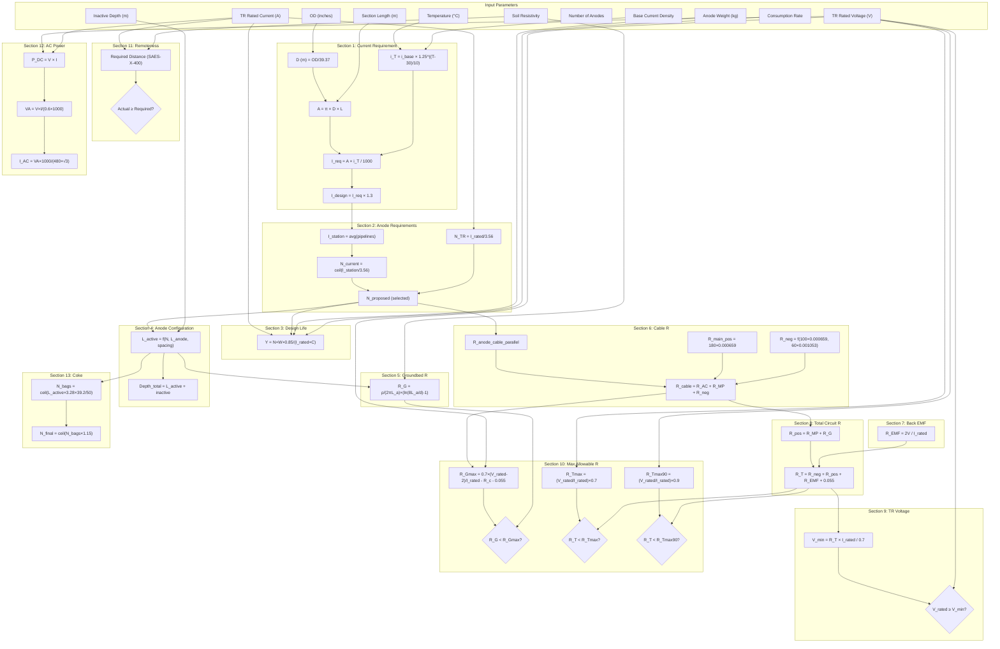

# FORMULA DEPENDENCY MAP — Calculation Dependency Graph

> **Source:** `PCP Calculation sheet.xlsx` > Sheet: `Cal.(DW)`
> **Formula Count:** ~120 interconnected formulas across 13 sections

---

## 1. Topological Calculation Order

The calculation engine follows a strict sequential dependency chain. Each step depends on the outputs of previous steps.

```
Step 01: INPUT PARAMETERS
        ↓
Step 02: Pipeline Dimensions (1.1-1.2)
        → D (m) = OD(in) / 39.37
        → L (m) = L_end - L_start
        ↓
Step 03: Surface Area (1.9)
        → A = π × D × L
        ↓
Step 04: Temperature-Corrected CD (1.10)
        → i_T = i_base × 1.25^((T-30)/10)
        ↓
Step 05: Current Requirement (1.11-1.12)
        → I_req = A × i_T / 1000
        → I_design = I_req × 1.30
        ↓
Step 06: Station Current Sharing (2.2)
        → I_station = (I_TieIn + I_Main) × 0.5
        ↓
Step 07: Anode Count (2.3-2.6)
        → N_current = CEILING(I_station / 3.56)
        → N_TR = I_TR_rated / 3.56
        → N_proposed = max(N_current, N_TR, engineering judgement)
        ↓
Step 08: Design Life Verification (3.1-3.6)
        → Y = (N × W × 0.85) / (I_rated × C)
        ↓
Step 09: Anode Configuration (4.1-4.15)
        → L_active = top_gap + (N × L_anode) + ((N-1) × spacing) + bottom_coke
        → Depth_total = L_active + inactive_depth + plug
        ↓
Step 10: Groundbed Resistance (5.1-5.9)
        → R_G = ρ/(2πL_a) × (ln(8L_a/d) - 1)          [Deepwell - Dwight]
        → R_G = Sunde's formula for multiple verticals    [Shallow]
        ↓
Step 11: Cable Resistances (6.1-6.35)
        → R_anode_tail_i = L_i × 0.001673               [16mm² cable]
        → R_ac = 1/Σ(1/R_anode_tail_i)                   [Parallel comb.]
        → R_main_pos = 180 × 0.000659                    [35mm² cable]
        → R_neg = (100 × 0.000659) + (60 × 0.001053)     [35mm² + 25mm²]
        → R_cable_total = R_ac + R_main_pos + R_neg
        ↓
Step 12: Back EMF (7.1-7.3)
        → R_EMF = 2V / I_rated
        ↓
Step 13: Total Circuit R (8.1-8.5)
        → R_pos = R_main_pos + R_G
        → R_T = R_neg + R_pos + R_EMF + 0.055
        ↓
Step 14: TR Voltage Check (9.1-9.4)
        → V_min = (R_T × I_rated) / 0.7
        → Check: V_rated ≥ V_min
        ↓
Step 15: Max Allowable Resistances (10.1-10.18)
        → R_Gmax = 0.7 × (V_rated - 2) / I_rated - R_cable - 0.055
        → R_Tmax = (V_rated / I_rated) × 0.7
        → R_Tmax90 = (V_rated / I_rated) × 0.9
        ↓
Step 16: Remoteness Check (11.1-11.5)
        → Required distance (SAES-X-400 table lookup)
        → Check: Actual ≥ Required
        ↓
Step 17: AC Power (12.1-12.9)
        → VA = V_rated × I_rated / 0.6
        → I_AC = VA / (480 × √3)
        ↓
Step 18: Coke Requirement (13.1-13.4)
        → N_bags = CEILING(L_active × 3.28 × 39.2 / 50)
```

---

## 2. Detailed Dependency Graph

### Input Parameters (Leaf Nodes — No Dependencies)

| Cell | Parameter | Value | Section |
|---|---|---|---|
| F12/G12 | Pipeline OD (inches) | 48 | 1.1 |
| F14/G14 | Pipe wall thickness (inches) | 0.875 | 1.3 |
| F15/G15 | Operating temperature (°C) | 57.22 | 1.4 |
| F17/G17 | Section start (m) | 0 | 1.5 |
| F18/G18 | Section end (m) | 292 / 41,480 | 1.6 |
| F20/G20 | Base current density (mA/m²) | 0.1 | 1.8 |
| F30/I30 | Anode current output (A) | 3.56 | 2.3 |
| F32/I32 | TR rated current (A) | 25 / 35 | 2.4 |
| F34/I34 | Proposed anode count | 9 / 12 | 2.6 |
| F39/I39 | Single anode weight (kg) | 38.6 | 3.2 |
| F40/I40 | Consumption rate (kg/A-Y) | 0.45 | 3.3 |
| F48/I48 | Inactive/starting depth (m) | 15 / 3 | 4.2 |
| F50/I50 | Anode length (m) | 2.13 | 4.4 |
| F51 | Top gap to first anode (m) | 1.5 | 4.5 |
| F52/I52 | Anode spacing (m) | 1.5 / 2.0 | 4.6 |
| F53 | Bottom coke coverage (m) | 2.5 | 4.7 |
| F54 | Bottom cement plug (m) | 0.5 | 4.8 |
| F58/I58 | Borehole diameter (m) | 0.25 | 4.12 |
| F59/I59 | Soil resistivity (Ω·cm) | 361.01 / 450.11 | 4.13 |
| F133/I133 | Main positive cable length (m) | 180 | 6.28 |
| F137/I137 | Main negative cable length (m) | 100 | 6.30 |
| F139/I139 | Negative cable 25mm² length (m) | 60 | 6.32 |
| F148/I148 | Back EMF (V) | 2 | 7.2 |
| F155/I155 | Structure-to-earth R (Ω) | 0.055 | 8.4 |
| F162/I162 | Proposed TR voltage (V) | 30 / 50 | 9.4 |
| F194/I194 | Actual distance to structure (m) | 56 / 45 | 11.4 |
| F198/I198 | AC input voltage (V) | 480 | 12.1 |
| F199/I199 | AC phases | 3 | 12.2 |
| F200 | Efficiency (%) | 80 | 12.3 |
| F201 | Power factor | 0.8 | 12.4 |

### Cable Constants

| Cell | Resistance | Cable Size |
|---|---|---|
| D101-D120 | 0.001673 Ω/m | 16mm² anode tail cable |
| D124, D134, D138 | 0.000659 Ω/m | 35mm² main cable |
| D140 | 0.001053 Ω/m | 25mm² negative cable |

### Intermediate Calculations

```
F13 = F12/39.37                              → D in meters
F19 = F18-F17                                → Section length L
F21 = 3.14*(F19*F13)                         → Surface area A
F22 = F20*1.25^((F15-30)/10)                 → Temp-corrected CD i_T
F23 = F21*F22/1000                           → Current req I_req
F24 = F23*1.3                                → Design current I_design
F29 = (F24+G24)*0.5                          → Station total current
F31 = ROUNDUP(F29/F30,0)                     → Anodes by current
F33 = F32/F30                                → Anodes by TR
F42 = (F38*F39*0.85)/(F41*F40)              → Design life Y
F55 = ROUND(F51+(F49*F50)+((F49-1)*F52)+F53,0) → Active length L_a
F57 = F55+F48+F54                            → Total drilling depth
F67 = F48*100                                → Inactive depth (cm)
F68 = F50*100                                → Anode length (cm)
F72 = F55*100                                → Active length (cm)
F73 = F58*100                                → Borehole dia (cm)
F75 = (F71/(2*PI()*F72))*(LN((8*F72/F73))-1)  → R_G Dwight formula
F79 = F48+10                                 → Anode 1 cable length
F80-F98 = IF(...) → CEILING(prev + spacing + anode_len, 5)  → Cable lengths
F101-F120 = length * D101                    → Individual cable R
F121 = 1/SUMPRODUCT(1/R_parallel)            → Total parallel anode cable R
F134 = F133*D134                             → Main positive cable R
F138 = F137*D138                             → Main negative cable R (35mm²)
F140 = F139*D140                             → Negative cable R (25mm²)
F141 = F140+F138                             → Total negative R
F143 = F121+F134+F141                        → Total cable R (R_c)
F149 = F148/F147                             → R_EMF
F152 = F134+F129                             → Positive circuit R (R_G + R_c_pos)
F156 = F153+F152+F154+F155                  → Total circuit R (R_T)
F161 = (F159*F160)/0.7                      → Min TR voltage V_min
F171 = (0.7*((F167-F169)/F168))-F166-F170   → R_Gmax
F178 = (F177/F176)*0.7                      → R_Tmax (70%)
F185 = (F184/F183)*0.9                      → R_Tmax90 (90% warning)
F193 = IF(...) nested SAES-X-400 table      → Required remoteness
F204 = F202*F203                            → DC power (W)
F205 = (F203*F202)/(0.6)/1000               → AC kVA
F206 = F205*1000/(F198*SQRT(F199))          → AC current (A)
F212 = ROUNDUP((F210*3.28*39.2)/50,0)       → Coke bags
F213 = ROUNDUP(F212*1.15,0)                 → Coke bags + 15%
```

### Output Parameters (Final Results)

| Cell | Output | Value | Used By |
|---|---|---|---|
| F21 | Surface area (m²) | 1,117.86 | Current req. |
| F24 | Design current (A) | 0.268 | Anode calc |
| F29 | Station current (A) | 19.08 | Anode count |
| F34 | Proposed anodes | 9 | BOM, config |
| F42 | Design life (years) | 26.25 | Validation |
| F55 | Active column (m) | 35 | Drilling, R_G, coke |
| F57 | Total depth (m) | 50.5 | Drilling |
| F75 | Groundbed R (Ω) | 0.0988 | Circuit calc |
| F121 | Total anode cable R (Ω) | 0.00763 | Circuit calc |
| F134 | Main pos cable R (Ω) | 0.1186 | Circuit calc |
| F141 | Total neg cable R (Ω) | 0.1291 | Circuit calc |
| F143 | Total cable R (Ω) | 0.2553 | R_Gmax check |
| F149 | R_EMF (Ω) | 0.08 | Circuit calc |
| F156 | Total circuit R (Ω) | 0.4815 | TR sizing |
| F161 | Min TR voltage (V) | 17.20 | TR sizing |
| F171 | R_Gmax (Ω) | 0.4737 | Validation |
| F173 | PASS/FAIL (R_G < R_Gmax) | YES | Validation |
| F178 | R_Tmax (Ω) | 0.84 | Validation |
| F180 | PASS/FAIL (R_T < R_Tmax) | YES | Validation |
| F185 | R_Tmax90 (Ω) | 1.08 | Warning limit |
| F187 | PASS/FAIL (R_T < R_Tmax90) | Yes | Validation |
| F193 | Required remoteness (m) | 20 | Validation |
| F195 | REMOTENESS PASS/FAIL | Yes | Validation |
| F204 | DC power (W) | 750 | AC calc |
| F205 | AC kVA | 1.25 | AC calc |
| F206 | AC current (A) | 1.50 | AC calc |
| F212 | Coke bags (base) | 91 | BOM |
| F213 | Coke bags (contingency) | 105 | BOM |

---

## 3. Dependency Visual (Mermaid)



---

## 4. Circular Reference Check

| Status | Count |
|---|---|
| **Circular references** | None detected |
| **Self-referencing cells** | None |
| **Iterative calculations** | None |

The calculation graph is strictly acyclic — every formula depends only on cells computed earlier in the sequence.

---

## 5. Cross-Sheet References

```
Cal.(DW) formulas → BOM-(DW) quantities via ='Cal.(DW)'!Cell
  - F27 (station name) → BOM-(DW)!G9
  - F34 (anode count ×2) → BOM-(DW)!G5
  - F48 (active start) → BOM-(DW)!G6  
  - F55 (active column length) → BOM-(DW)!G7
  - F79-F90 (cable lengths) → BOM-(DW)!C21-C32
  - F167 (TR voltage) → BOM-(DW)!G1
  - F168 (TR current) → BOM-(DW)!G2
  - F213 (coke bags) → BOM-(DW)!G49
```

**No back-references** from BOM sheets to Cal.(DW). BOM is a passive consumer of calculation results.
