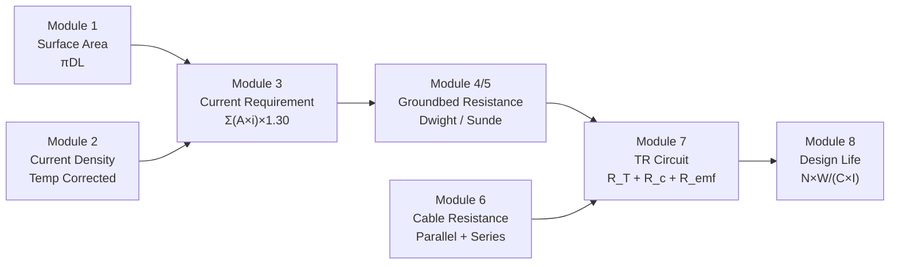

# Calculation Modules

The platform implements 7 calculation modules based on industry standards:

## Standards Reference

| Module | Formula | Standard |
|--------|---------|----------|
| Surface Area | πDL | NACE SP0169 §5.2.2.1 |
| Temp Current Density | i×[1+(T-25)×k] | NACE SP0169 §5.2.2.3 |
| Deepwell R_G | Dwight (1936) | NACE SP0169 |
| Shallow R_G | Sunde (1968) | NACE SP0169 |
| Cable Resistance | Ohm's law | IEC 60287 |
| TR Circuit | R_T+R_c+R_emf+R_s | Industry Practice |
| Design Life | N×W/(C×I) | Industry Practice |

## Precision

All calculations use **Decimal.js** for arbitrary-precision decimal arithmetic,
with **MathJS** for unit conversions and symbolic computation verification.
