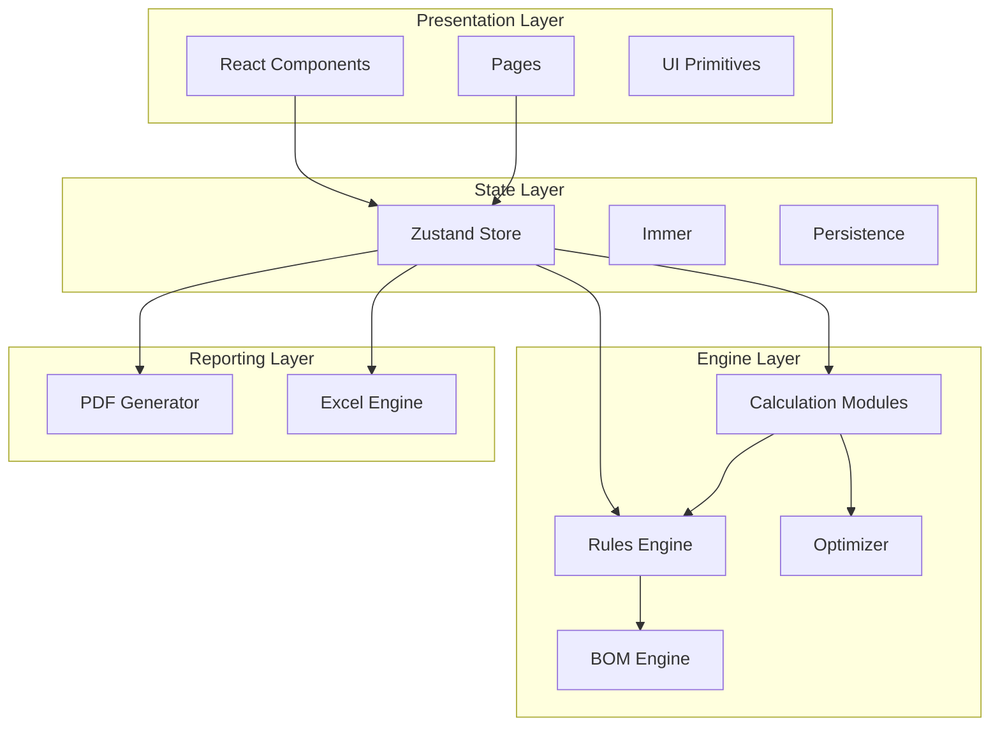

# CP Designer — Permanent ICCP Engineering Platform

**A professional-grade engineering calculation platform for Impressed Current Cathodic Protection (ICCP) design.**

## Architecture Overview



## Key Features

- **7 Calculation Modules** — NACE SP0169, Dwight, Sunde, IEC 60287 compliant
- **Validation Rules Engine** — 6 business rules + proactive insights
- **Design Optimizer** — 4 alternatives compared automatically
- **Professional Reporting** — PDF and Excel export
- **8-Layer Architecture** — Domain-Driven Modular Layered Architecture (DDMLA)

## Quick Start

```bash
npm install
npm run dev        # Development server on port 3000
npm run build      # Production build
npm test           # Run tests
npm run docs:serve # Documentation site
```

## Technology Stack

| Layer | Technology |
|-------|-----------|
| Framework | React 19 |
| Build | Vite 8 |
| State | Zustand 5 + Immer 11 |
| Testing | Vitest 4 + Playwright |
| Validation | Zod 4 |
| Precision | Decimal.js + MathJS |
| Linting | ESLint 10 + Prettier |
| Docs | MkDocs Material |
| CI/CD | GitHub Actions |
